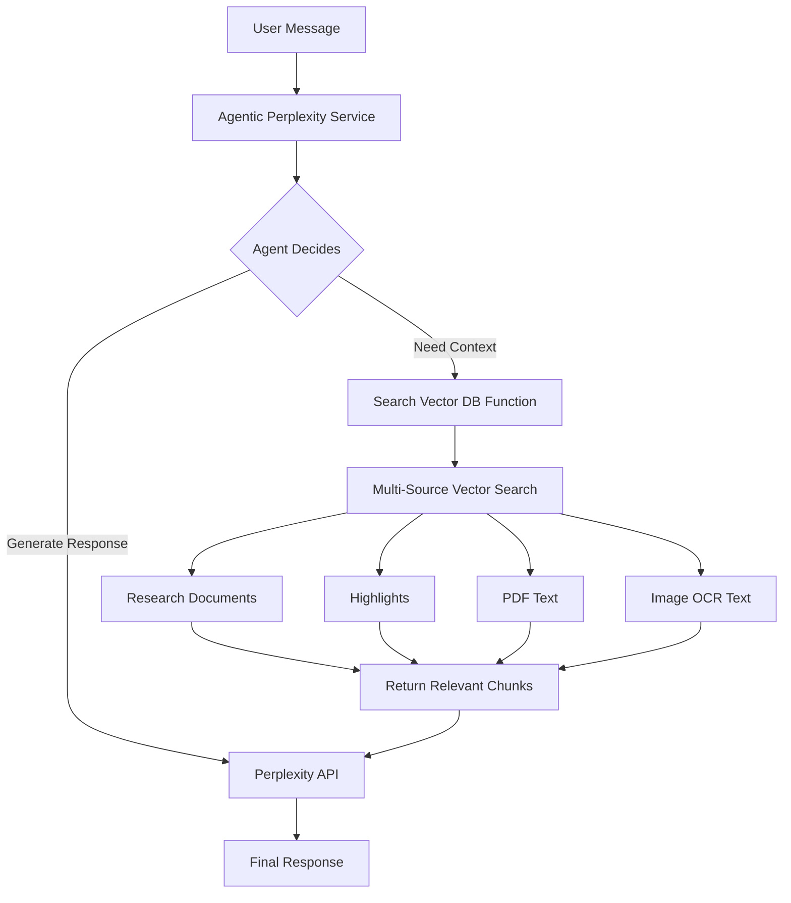

<!-- 8613246f-9eec-4a85-ad2d-790d5d717a55 98cde5fe-b3a5-4782-91dd-5a55f873d248 -->
# Agentic Framework with Multi-Source Vectorization Implementation Plan

## Overview

This plan implements an agentic framework using OpenAI Agents SDK with Perplexity, adds multi-source vectorization for RAG (highlights, PDF text, OCR text), and progressively enhances system prompts from simple to rich.

## Architecture

## Phase 0: Agentic Framework Setup

### Goal

Set up basic agentic infrastructure with function calling using OpenAI Agents SDK and Perplexity.

### Tasks

#### 0.1 Install Dependencies

- Add to `backend/requirements.txt`:
  - `openai-agents>=0.1.0` (or latest compatible version)
  - `nest-asyncio>=1.5.0` (for async support in Flask)

#### 0.2 Create Agentic Service

- Create `backend/services/agentic_perplexity_service.py`:
  - Initialize `AsyncOpenAI` client pointing to `https://api.perplexity.ai`
  - Create basic `search_vector_database` function tool (for now, just calls existing `vector_service.search_relevant_chunks`)
  - Create `create_agent()` function that builds Agent with basic instructions
  - Create `chat_completion_agentic()` async function that runs the agent

#### 0.3 Update Chat Route for Async

- Modify `backend/routes/chat.py`:
  - Update `send_message()` route to be async (Flask 2.0+ supports async)
  - Replace direct `perplexity_service.chat_completion()` call with `agentic_perplexity_service.chat_completion_agentic()`
  - Handle async response properly

#### 0.4 Preserve Current System Prompts

- Create `backend/prompts/ORIGINAL_SYSTEM_PROMPTS.md`:
  - Document current `system_message_write` from `chat.py:520-548`
  - Document current `system_message_research` from `chat.py:550-575`
  - Include revision context logic from `chat.py:587-612`

#### 0.5 Create Simplified System Prompts (Phase 0)

- Create `backend/prompts/SIMPLIFIED_PROMPTS_PHASE_0.md`:
  - Basic write mode prompt (minimal instructions, JSON format only)
  - Basic research mode prompt (conversational, JSON format only)
  - Update `chat.py` to use simplified prompts for Phase 0

### Test Scenarios (Phase 0)

#### Test 0.1: Basic Function Calling

- **Setup**: Create a test document with known content, index it
- **Query**: "What did I write about machine learning?"
- **Expected**: Agent calls `search_vector_database()`, retrieves relevant chunks, includes in response
- **Verify**: Logs show function call occurred, response references document content

#### Test 0.2: Simple Content Generation

- **Query**: "Write a paragraph about AI ethics"
- **Expected**: Agent generates markdown content, returns in JSON format
- **Verify**: Response contains `document_content` field with markdown

#### Test 0.3: Research Mode Conversation

- **Mode**: Research
- **Query**: "Tell me about neural networks"
- **Expected**: Conversational response, `document_content` is empty string
- **Verify**: No function call (research mode doesn't need context yet)

## Phase I: Multi-Source Vectorization

### Goal

Add vectorization for highlights, full PDF text, and full image OCR text. Enhance vector search to support all source types.

### Tasks

#### I.1 Enhance DocumentEmbeddingModel Schema

- Update `backend/models/database.py`:
  - Modify `DocumentEmbeddingModel.create_embedding()` to accept:
    - `source_type`: 'research_document', 'highlight', 'pdf', 'image_ocr'
    - `source_id`: highlight_id, pdf_id, image_id, document_id
    - `project_id`: for filtering
    - `user_id`: for user isolation
  - Update metadata structure to include source-specific fields

#### I.2 Update VectorService

- Modify `backend/services/vector_service.py`:
  - Add `index_highlight()` method: index highlight text + note
  - Add `index_pdf_full_text()` method: extract full PDF text using PyMuPDF's `get_text()`, chunk and index
  - Add `index_image_ocr()` method: run full OCR on image, chunk and index
  - Update `search_relevant_chunks()` to:
    - Accept optional `source_types` filter (list of source types)
    - Accept optional `project_id` filter
    - Return results with `source_type` and `source_id` metadata
    - Search across all source types by default

#### I.3 Add PDF Text Extraction

- Update `backend/services/pdf_extraction_service.py`:
  - Add `extract_full_text()` method:
    - Use PyMuPDF: `page.get_text()` for each page
    - Combine all pages into single text
    - Return full text string
- Update `backend/routes/pdf.py`:
  - In `extract_highlights_async()`, after highlight extraction:
    - Call `extract_full_text()` on PDF
    - Call `vector_service.index_pdf_full_text(pdf_id, full_text, user_id, project_id)`

#### I.4 Add Image OCR Extraction

- Update `backend/services/ocr_position_service.py`:
  - Add `extract_full_text()` method:
    - Run Tesseract OCR on entire image: `pytesseract.image_to_string(img)`
    - Return full OCR text
- Update `backend/routes/pdf.py`:
  - In `extract_highlights_async()`, for image uploads:
    - Call `ocr_service.extract_full_text()` on image
    - Call `vector_service.index_image_ocr(image_id, ocr_text, user_id, project_id)`

#### I.5 Index Highlights on Save

- Update `backend/routes/highlight.py`:
  - In `save_highlight()` route, after saving highlight:
    - Combine `highlight_text` + `note` (if exists)
    - Call `vector_service.index_highlight(highlight_id, combined_text, user_id, project_id, source_url)`
- Update `backend/routes/pdf.py`:
  - In `update_highlights()` method, after saving each highlight:
    - Index each highlight individually

#### I.6 Update Agentic Service for Multi-Source Search

- Update `backend/services/agentic_perplexity_service.py`:
  - Enhance `search_vector_database()` function tool:
    - Accept optional `source_types` parameter (default: all sources)
    - Accept `project_id` from agent context
    - Call `vector_service.search_relevant_chunks()` with filters
    - Format results to show source type and metadata
    - Include source URLs/identifiers in response

#### I.7 Create Simplified System Prompts (Phase I)

- Create `backend/prompts/SIMPLIFIED_PROMPTS_PHASE_I.md`:
  - Write mode: Basic instructions + function calling hint ("When user asks about existing content, call search_vector_database first")
  - Research mode: Basic instructions + function calling hint
  - Update `chat.py` to use Phase I simplified prompts

### Test Scenarios (Phase I)

#### Test I.1: Highlight Vectorization

- **Setup**: Save a highlight with text "Machine learning is revolutionizing AI"
- **Action**: Wait for indexing to complete
- **Query**: "What did I highlight about machine learning?"
- **Expected**: Agent calls `search_vector_database()`, finds highlight, includes in response
- **Verify**: Response mentions highlight text, indicates it came from a highlight

#### Test I.2: PDF Full Text Vectorization

- **Setup**: Upload PDF with text "Deep learning requires large datasets"
- **Action**: Wait for extraction and indexing
- **Query**: "What did the PDF say about deep learning?"
- **Expected**: Agent finds PDF text content (not just highlights)
- **Verify**: Response includes content from PDF full text, indicates PDF source

#### Test I.3: Image OCR Vectorization

- **Setup**: Upload image with text "Natural language processing enables chatbots"
- **Action**: Wait for OCR and indexing
- **Query**: "What text was in the uploaded image?"
- **Expected**: Agent finds OCR text content
- **Verify**: Response includes OCR text, indicates image OCR source

#### Test I.4: Multi-Source Search

- **Setup**: 
  - Document: "AI is transforming industries"
  - Highlight: "Machine learning is key"
  - PDF: "Deep learning requires GPUs"
- **Query**: "What did I save about AI and machine learning?"
- **Expected**: Agent searches all sources, returns relevant chunks from multiple sources
- **Verify**: Response includes content from document, highlight, and/or PDF

#### Test I.5: Source Type Filtering

- **Setup**: Create highlights and documents with similar content
- **Query**: "What highlights did I save about topic X?" (implicit filter to highlights)
- **Expected**: Agent only searches highlights, ignores documents
- **Verify**: Response only includes highlight content

#### Test I.6: Function Calling Decision Making

- **Query 1**: "Hello, how are you?" (no context needed)
- **Expected**: Agent does NOT call function, responds directly
- **Query 2**: "What did I write about X?" (needs context)
- **Expected**: Agent calls `search_vector_database()` first, then responds
- **Verify**: Logs show function call decision making

## Phase II: Rich System Prompts

### Goal

Enhance system prompts with detailed instructions for function calling, content generation, and multi-source RAG strategies.

### Tasks

#### II.1 Create Rich System Prompts

- Create `backend/prompts/RICH_PROMPTS_PHASE_II.md`:
  - **Write Mode Prompt**:
    - Detailed function calling strategy (when to call search_vector_database)
    - Multi-source RAG instructions (combine document, highlights, PDFs, OCR)
    - Content generation guidelines (markdown formatting, structure)
    - Source attribution rules
    - Revision handling (existing revision context logic)
  - **Research Mode Prompt**:
    - Function calling for context retrieval
    - Multi-source synthesis instructions
    - Conversation guidelines with source references
    - Research assistance best practices

#### II.2 Update Chat Route with Rich Prompts

- Update `backend/routes/chat.py`:
  - Replace simplified prompts with rich prompts from Phase II
  - Preserve revision context logic
  - Add source type hints in prompts

#### II.3 Enhance Agent Instructions

- Update `backend/services/agentic_perplexity_service.py`:
  - Include rich instructions in agent creation
  - Add examples of when to call functions
  - Include multi-source RAG strategy in instructions

### Test Scenarios (Phase II)

#### Test II.1: Intelligent Function Calling

- **Query**: "Summarize what I've written and highlighted about topic X"
- **Expected**: Agent calls `search_vector_database()` multiple times (or once with all sources), synthesizes from multiple sources
- **Verify**: Response synthesizes content from document and highlights, cites sources

#### Test II.2: Source Attribution

- **Query**: "Tell me about topic Y"
- **Expected**: Response distinguishes between document content, highlights, PDF content, OCR text
- **Verify**: Response indicates source types in natural language ("From your highlights...", "In your document...")

#### Test II.3: Context-Aware Content Generation

- **Setup**: Existing document with "Introduction: AI basics"
- **Query**: "Add a section on machine learning after the introduction"
- **Expected**: Agent calls function to get document context, generates content that fits after introduction
- **Verify**: Generated content is contextual and properly formatted

#### Test II.4: Multi-Source Synthesis

- **Setup**: Document, highlight, and PDF all mention different aspects of same topic
- **Query**: "Write a comprehensive section on topic Z using all my sources"
- **Expected**: Agent retrieves from all sources, synthesizes coherent content
- **Verify**: Response combines information from all three source types

#### Test II.5: Research Mode with Sources

- **Mode**: Research
- **Query**: "What do my highlights say about X, and what does the PDF say?"
- **Expected**: Conversational response that references both highlights and PDF, `document_content` is empty
- **Verify**: Response is conversational but well-sourced, no content generation

## Implementation Files

### New Files

- `backend/services/agentic_perplexity_service.py` - Agentic service with function calling
- `backend/prompts/ORIGINAL_SYSTEM_PROMPTS.md` - Preservation of current prompts
- `backend/prompts/SIMPLIFIED_PROMPTS_PHASE_0.md` - Minimal prompts for Phase 0
- `backend/prompts/SIMPLIFIED_PROMPTS_PHASE_I.md` - Basic prompts with function hints
- `backend/prompts/RICH_PROMPTS_PHASE_II.md` - Detailed prompts with full instructions

### Modified Files

- `backend/requirements.txt` - Add agentic dependencies
- `backend/models/database.py` - Enhance DocumentEmbeddingModel schema
- `backend/services/vector_service.py` - Add multi-source indexing and search
- `backend/services/pdf_extraction_service.py` - Add full PDF text extraction
- `backend/services/ocr_position_service.py` - Add full OCR text extraction
- `backend/routes/chat.py` - Make async, use agentic service, update prompts
- `backend/routes/pdf.py` - Add vectorization on upload/extraction
- `backend/routes/highlight.py` - Add vectorization on highlight save

## Testing Strategy

### Manual Testing

- Test scenarios above for each phase
- Verify function calling logs
- Verify vector search results
- Verify response quality

### Automated Testing (Optional)

- Unit tests for vector service methods
- Integration tests for agentic service
- Mock tests for function calling

## Dependencies

- `openai-agents>=0.1.0` (or latest)
- `nest-asyncio>=1.5.0`
- Existing: `pymupdf>=1.23.0`, `pytesseract>=0.3.10`

## Success Criteria

- Phase 0: Agent successfully calls functions when needed
- Phase I: All source types (documents, highlights, PDFs, OCR) are vectorized and searchable
- Phase II: Agent intelligently uses multi-source context, generates high-quality responses with proper source attribution

### To-dos

- [x] Install dependencies: openai-agents and nest-asyncio
- [x] Create agentic_perplexity_service.py with basic function calling setup
- [x] Preserve current system prompts in ORIGINAL_SYSTEM_PROMPTS.md
- [x] Create SIMPLIFIED_PROMPTS_PHASE_0.md with minimal instructions
- [x] Update chat.py send_message route to async and use agentic service
- [ ] Run Phase 0 test scenarios (basic function calling, content generation, research mode)
- [ ] Enhance DocumentEmbeddingModel to support source_type, source_id, project_id, user_id
- [ ] Add index_highlight(), index_pdf_full_text(), index_image_ocr() methods to VectorService
- [ ] Add extract_full_text() method to pdf_extraction_service.py using PyMuPDF get_text()
- [ ] Add extract_full_text() method to ocr_position_service.py using pytesseract
- [ ] Update pdf.py to index full PDF text after highlight extraction
- [ ] Update pdf.py to index full OCR text for image uploads
- [ ] Update highlight.py and pdf.py to index highlights on save
- [ ] Update search_relevant_chunks() to support source_types filter and multi-source search
- [ ] Enhance search_vector_database function tool to support source filtering
- [ ] Create SIMPLIFIED_PROMPTS_PHASE_I.md with function calling hints
- [ ] Run Phase I test scenarios (highlight, PDF, OCR vectorization, multi-source search)
- [ ] Create RICH_PROMPTS_PHASE_II.md with detailed instructions for function calling and multi-source RAG
- [ ] Update chat.py to use rich prompts from Phase II
- [ ] Enhance agent creation with rich instructions and examples
- [ ] Run Phase II test scenarios (intelligent function calling, source attribution, synthesis)