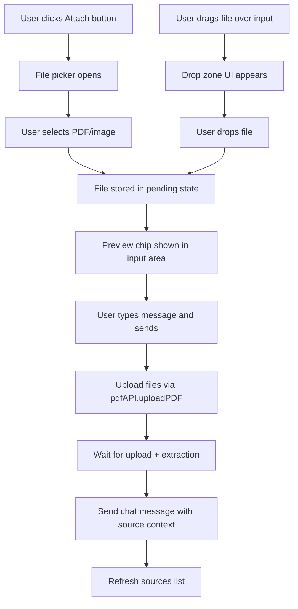

<!-- a06fd740-728e-4f12-ae25-3fb7e9b3fffe 12a0ba01-ca75-4b94-a93c-f5f0aece7735 -->
# Chat File Upload Feature

## Overview

Enable users to attach PDF/image files in the chat message box via click or drag-and-drop. On send, files are uploaded as sources (same flow as "Upload New" button) and their content is sent to the AI for context.

## Architecture



## Key Files to Modify

1. **[ChatWindow.js](frontend/src/components/ChatWindow/ChatWindow.js)** - Main changes:

   - Add state for pending file attachments and drag state
   - Add hidden file input element
   - Wire up existing `AttachIcon` button (line 1079-1086) to trigger file picker
   - Add drag-and-drop handlers with visual feedback
   - Display pending file chips in the input area (similar to attached highlights)
   - Modify `sendMessageToSession` to upload files before sending message
   - Include uploaded source info in the chat context

2. **[ChatWindow.css](frontend/src/components/ChatWindow/ChatWindow.css)** - Styling:

   - Style for pending file attachment chips
   - Drag-over state with drop zone overlay
   - Loading indicator during upload

## Implementation Details

### 1. Add State for Pending Files (ChatWindow.js)

```javascript
const [pendingFiles, setPendingFiles] = useState([]); // Array of File objects
const [uploadingFiles, setUploadingFiles] = useState(false);
const [isDraggingOver, setIsDraggingOver] = useState(false);
const chatFileInputRef = useRef(null);
```

### 2. Add Hidden File Input Element

Insert near the textarea in the chat input area:

```javascript
<input
  type="file"
  ref={chatFileInputRef}
  onChange={handleFileSelect}
  accept=".pdf,.jpg,.jpeg,.png"
  multiple
  style={{ display: 'none' }}
/>
```

### 3. Wire AttachIcon Button (line 1079-1086)

Change the existing attach button to trigger file input:

```javascript
<button
  type="button"
  className="attach-button"
  onClick={() => chatFileInputRef.current?.click()}
  disabled={uploadingFiles}
>
  <AttachIcon className="attach-button-icon" />
</button>
```

### 4. File Selection Handler

```javascript
const handleFileSelect = (e) => {
  const files = Array.from(e.target.files || []);
  addValidFiles(files);
  e.target.value = ''; // Reset input for re-selection
};

const addValidFiles = (files) => {
  const validFiles = files.filter(file => {
    const ext = file.name.toLowerCase();
    return ext.endsWith('.pdf') || ext.endsWith('.jpg') || 
           ext.endsWith('.jpeg') || ext.endsWith('.png');
  });
  if (validFiles.length > 0) {
    setPendingFiles(prev => [...prev, ...validFiles]);
  }
};
```

### 5. Drag and Drop Handlers

```javascript
const handleDragOver = (e) => {
  e.preventDefault();
  e.stopPropagation();
  setIsDraggingOver(true);
};

const handleDragLeave = (e) => {
  e.preventDefault();
  e.stopPropagation();
  // Only set to false if leaving the container entirely
  if (!e.currentTarget.contains(e.relatedTarget)) {
    setIsDraggingOver(false);
  }
};

const handleDrop = (e) => {
  e.preventDefault();
  e.stopPropagation();
  setIsDraggingOver(false);
  
  const files = Array.from(e.dataTransfer.files || []);
  addValidFiles(files);
};
```

### 6. Apply Drag Handlers to Input Container

Wrap the chat input container with drag event handlers:

```javascript
<div 
  className={`chat-input-container ${isDraggingOver ? 'drag-over' : ''}`}
  onDragOver={handleDragOver}
  onDragLeave={handleDragLeave}
  onDrop={handleDrop}
>
  {/* Drag overlay - shown when dragging files over */}
  {isDraggingOver && (
    <div className="chat-drag-overlay">
      <div className="chat-drag-overlay-content">
        <AttachIcon className="chat-drag-overlay-icon" />
        <span>Drop PDF or image to attach</span>
      </div>
    </div>
  )}
  {/* ... rest of input container */}
</div>
```

### 7. Display Pending Files UI

Add file chips in the attached items container (similar to highlights):

```javascript
{pendingFiles.length > 0 && (
  <div className="attached-files-indicator">
    {pendingFiles.map((file, idx) => (
      <div key={idx} className="attached-file-chip">
        {file.name.toLowerCase().endsWith('.pdf') ? 
          <PdfIcon className="file-type-icon" /> : 
          <ImageIcon className="file-type-icon" />}
        <span className="file-name">{truncateFileName(file.name)}</span>
        <button 
          className="remove-file-button"
          onClick={() => removePendingFile(idx)}
        >
          <DeleteIcon />
        </button>
      </div>
    ))}
  </div>
)}

const removePendingFile = (index) => {
  setPendingFiles(prev => prev.filter((_, i) => i !== index));
};
```

### 8. Modify Send Flow (sendMessageToSession)

Update to upload files before sending message:

```javascript
const sendMessageToSession = async (targetSessionId, userMessage) => {
  const filesToUpload = [...pendingFiles];
  
  // Upload any pending files first
  if (filesToUpload.length > 0) {
    setUploadingFiles(true);
    setPendingFiles([]); // Clear immediately for UX
    try {
      for (const file of filesToUpload) {
        await pdfAPI.uploadPDF(selectedProjectId, file);
      }
    } catch (err) {
      console.error('Failed to upload files:', err);
      // Show error but continue with message
    } finally {
      setUploadingFiles(false);
    }
  }
  
  // Add file info to message context
  let messageContent = userMessage;
  if (filesToUpload.length > 0) {
    const filesInfo = filesToUpload.map(f => f.name).join(', ');
    messageContent = `[New sources uploaded: ${filesInfo}]\n\n${messageContent}`;
  }
  
  // Continue with existing message send logic...
};
```

## CSS Additions (ChatWindow.css)

```css
/* Drag over state for input container */
.chat-input-container.drag-over {
  border-color: var(--accent-primary);
  background: var(--bg-secondary);
}

/* Drag overlay */
.chat-drag-overlay {
  position: absolute;
  inset: 0;
  background: rgba(var(--accent-primary-rgb), 0.1);
  border: 2px dashed var(--accent-primary);
  border-radius: 12px;
  display: flex;
  align-items: center;
  justify-content: center;
  z-index: 10;
  pointer-events: none;
}

.chat-drag-overlay-content {
  display: flex;
  flex-direction: column;
  align-items: center;
  gap: 8px;
  color: var(--accent-primary);
}

.chat-drag-overlay-icon {
  width: 32px;
  height: 32px;
}

/* File attachment chips */
.attached-files-indicator {
  display: flex;
  flex-wrap: wrap;
  gap: 6px;
  padding: 8px 0;
}

.attached-file-chip {
  display: flex;
  align-items: center;
  gap: 6px;
  padding: 4px 8px 4px 6px;
  background: var(--bg-tertiary);
  border: 1px solid var(--border-secondary);
  border-radius: 6px;
  font-size: 12px;
}

.attached-file-chip .file-type-icon {
  width: 14px;
  height: 14px;
  opacity: 0.7;
}

.attached-file-chip .file-name {
  max-width: 150px;
  overflow: hidden;
  text-overflow: ellipsis;
  white-space: nowrap;
}

.attached-file-chip .remove-file-button {
  display: flex;
  align-items: center;
  justify-content: center;
  padding: 2px;
  background: none;
  border: none;
  cursor: pointer;
  opacity: 0.5;
  transition: opacity 0.2s;
}

.attached-file-chip .remove-file-button:hover {
  opacity: 1;
}

.attach-button:disabled {
  opacity: 0.5;
  cursor: not-allowed;
}
```

## Testing Approach

- **Do NOT test in browser** - ask user to test manually
- Verify no linter errors using `read_lints` tool
- Check backend logs for any errors during uploads
- Ensure browser console has no errors

## Edge Cases to Handle

1. No project selected - show error message
2. Invalid file type - filter and show warning (only accept PDF, JPG, PNG)
3. Upload failure - show error but don't block message send
4. Empty message with files - allow send (files become the context)
5. Multiple files - upload sequentially to avoid rate limits
6. Drag leave into child element - handle with relatedTarget check
7. Non-file drag (text, links) - ignore gracefully

### To-dos

- [ ] Add pendingFiles state, uploadingFiles flag, and chatFileInputRef
- [ ] Add hidden file input element with accept for PDF/images
- [ ] Wire AttachIcon button to trigger file input click
- [ ] Implement handleFileSelect to validate and store selected files
- [ ] Add UI to show pending file chips with remove button
- [ ] Update sendMessageToSession to upload files before sending message
- [ ] Add CSS for file attachment chips and loading states
- [ ] Run linter checks and verify no backend/frontend errors