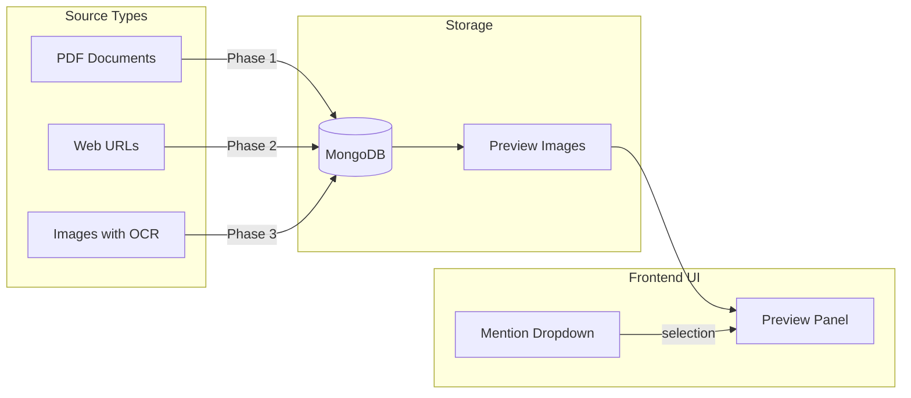
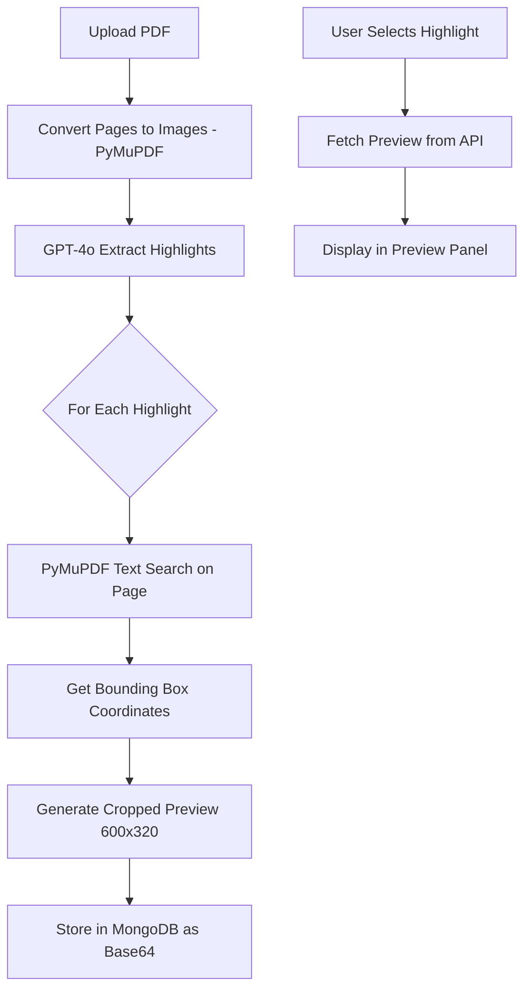
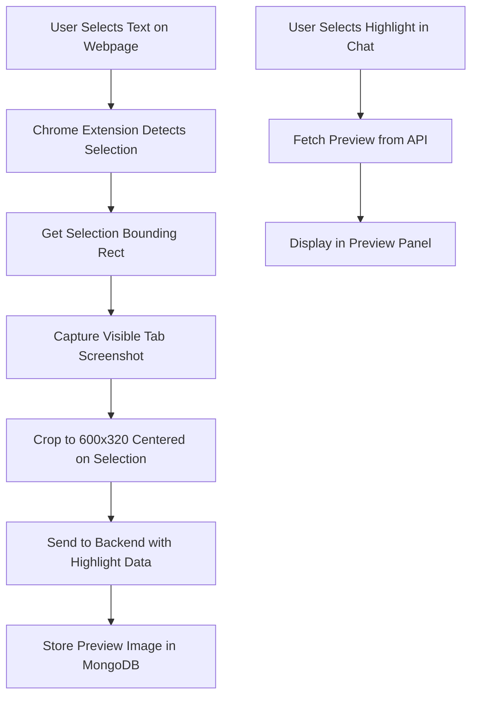
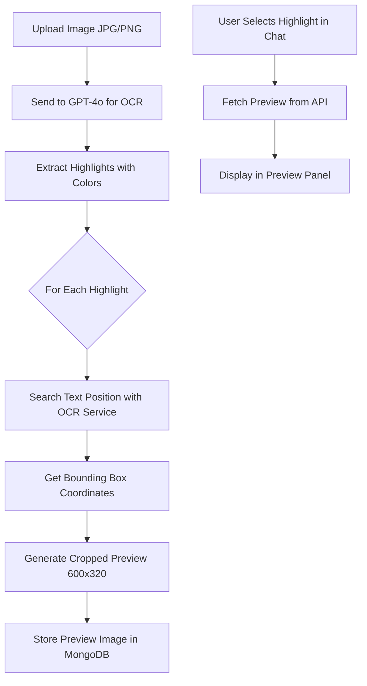

<!-- 4df66228-4347-42ed-be03-391d2df608c0 c70d324c-4006-4801-9d71-ab8dba98783a -->
# Highlight Preview Feature - Complete Implementation Plan

## Overview

Add a preview panel (600x320px) to the @ mention dropdown that shows document context when a highlight is selected (via hover or keyboard navigation). The preview displays a cropped screenshot centered on the highlighted text with surrounding context.



---

## Phase 1: PDF Documents

### Architecture



### Data Model Changes

Update highlight object in [`backend/models/database.py`](backend/models/database.py):

```python
# PDF highlight structure (in pdf_documents collection)
highlight = {
    'highlight_id': str,
    'text': str,
    'color_tag': str,
    'page_number': int,
    'note': str,
    'timestamp': datetime,
    # NEW FIELDS:
    'bounding_box': {
        'x0': float,      # Left (normalized 0-1)
        'y0': float,      # Top (normalized 0-1)
        'x1': float,      # Right (normalized 0-1)
        'y1': float       # Bottom (normalized 0-1)
    },
    'preview_image': str   # Base64 encoded PNG (600x320)
}
```

### Backend Implementation

#### 1. Add Position Detection to Extraction Service

Modify [`backend/services/pdf_extraction_service.py`](backend/services/pdf_extraction_service.py):

```python
def _find_highlight_position(self, doc, highlight_text, page_number):
    """
    Use PyMuPDF's text search to find highlight bounding box.
    Returns normalized coordinates (0-1 range).
    """
    page = doc[page_number - 1]
    # Search for text (handles multi-line)
    search_text = highlight_text[:100]  # Limit search length
    rects = page.search_for(search_text)
    
    if rects:
        rect = rects[0]  # Use first match
        page_rect = page.rect
        return {
            'x0': rect.x0 / page_rect.width,
            'y0': rect.y0 / page_rect.height,
            'x1': rect.x1 / page_rect.width,
            'y1': rect.y1 / page_rect.height
        }
    return None

def _generate_preview_image(self, doc, page_number, bbox, width=600, height=320):
    """
    Generate a cropped preview image centered on the highlight.
    Includes context above and below the highlight.
    """
    page = doc[page_number - 1]
    page_rect = page.rect
    
    # Calculate crop area centered on highlight
    highlight_center_y = (bbox['y0'] + bbox['y1']) / 2 * page_rect.height
    
    # Determine crop region with context
    crop_height_ratio = height / width * page_rect.width
    crop_top = max(0, highlight_center_y - crop_height_ratio / 2)
    crop_bottom = min(page_rect.height, crop_top + crop_height_ratio)
    
    # Render at higher DPI for quality
    clip = fitz.Rect(0, crop_top, page_rect.width, crop_bottom)
    mat = fitz.Matrix(2, 2)  # 2x scale
    pix = page.get_pixmap(matrix=mat, clip=clip)
    
    # Resize to target dimensions
    img_bytes = pix.tobytes("png")
    # Use PIL to resize to exactly 600x320
    from PIL import Image
    import io
    img = Image.open(io.BytesIO(img_bytes))
    img = img.resize((width, height), Image.LANCZOS)
    
    buffer = io.BytesIO()
    img.save(buffer, format='PNG', optimize=True)
    return base64.b64encode(buffer.getvalue()).decode('utf-8')
```

#### 2. Update Extraction Flow

Modify `_extract_from_pdf()` in [`backend/services/pdf_extraction_service.py`](backend/services/pdf_extraction_service.py):

```python
def _extract_from_pdf(self, pdf_base64_data):
    pdf_bytes = base64.b64decode(pdf_base64_data)
    doc = fitz.open(stream=pdf_bytes, filetype="pdf")
    images = self._pdf_to_images(pdf_bytes)
    
    all_highlights = []
    for page_num, image_base64 in enumerate(images, start=1):
        page_highlights = self._extract_highlights_from_image(image_base64, page_num)
        
        # NEW: Add position and preview for each highlight
        for highlight in page_highlights:
            bbox = self._find_highlight_position(doc, highlight['text'], page_num)
            if bbox:
                highlight['bounding_box'] = bbox
                highlight['preview_image'] = self._generate_preview_image(
                    doc, page_num, bbox
                )
            else:
                # Fallback: use page center if text not found
                highlight['preview_image'] = self._generate_page_preview(doc, page_num)
        
        all_highlights.extend(page_highlights)
    
    doc.close()
    return all_highlights
```

#### 3. Add Preview API Endpoint

Add to [`backend/routes/pdf.py`](backend/routes/pdf.py):

```python
@pdf_bp.route('/highlight-preview/<pdf_id>/<highlight_id>', methods=['GET'])
def get_highlight_preview(pdf_id, highlight_id):
    """Return preview image for a specific highlight."""
    user_id = get_user_id_from_token()
    if not user_id:
        return jsonify({'error': 'Unauthorized'}), 401
    
    pdf = PDFDocumentModel.get_pdf(pdf_id)
    if not pdf or pdf.get('user_id') != user_id:
        return jsonify({'error': 'PDF not found'}), 404
    
    for highlight in pdf.get('highlights', []):
        if highlight.get('highlight_id') == highlight_id:
            preview = highlight.get('preview_image')
            if preview:
                return jsonify({'preview_image': preview})
            return jsonify({'error': 'No preview available'}), 404
    
    return jsonify({'error': 'Highlight not found'}), 404
```

#### 4. Add Dependencies

Add to [`backend/requirements.txt`](backend/requirements.txt):

```
Pillow>=10.0.0
```

### Frontend Implementation

#### 1. Add Preview Panel to Mention Dropdown

Modify [`frontend/src/components/ChatWindow/ChatWindow.js`](frontend/src/components/ChatWindow/ChatWindow.js):

```jsx
// State for preview
const [previewImage, setPreviewImage] = useState(null);
const [previewLoading, setPreviewLoading] = useState(false);

// Fetch preview when selection changes
useEffect(() => {
  const selectedItem = mentionItems[mentionSelectedIndex];
  if (selectedItem?.type === 'highlight' && selectedItem?.sourceType === 'pdf') {
    fetchHighlightPreview(selectedItem);
  } else {
    setPreviewImage(null);
  }
}, [mentionSelectedIndex, mentionItems]);

const fetchHighlightPreview = async (item) => {
  setPreviewLoading(true);
  try {
    const response = await pdfAPI.getHighlightPreview(item.pdfId, item.data.highlight_id);
    setPreviewImage(response.data.preview_image);
  } catch (error) {
    setPreviewImage(null);
  }
  setPreviewLoading(false);
};

// In render, add preview panel next to dropdown:
{showMentionDropdown && (
  <div className="mention-dropdown-container">
    {/* Preview Panel - shows on left */}
    {(previewImage || previewLoading) && (
      <div className="mention-preview-panel">
        {previewLoading ? (
          <div className="preview-loading">Loading preview...</div>
        ) : (
          
        )}
      </div>
    )}
    
    {/* Dropdown */}
    <div className="mention-dropdown" ref={mentionDropdownRef}>
      {/* existing dropdown content */}
    </div>
  </div>
)}
```

#### 2. Add API Method

Add to [`frontend/src/services/api.js`](frontend/src/services/api.js):

```javascript
// In pdfAPI object:
getHighlightPreview: (pdfId, highlightId) => {
  return api.get(`/api/pdfs/highlight-preview/${pdfId}/${highlightId}`);
},
```

#### 3. CSS Styling

Add to [`frontend/src/components/ChatWindow/ChatWindow.css`](frontend/src/components/ChatWindow/ChatWindow.css):

```css
.mention-dropdown-container {
  position: absolute;
  bottom: calc(100% + 8px);
  left: 0;
  display: flex;
  flex-direction: row-reverse;
  gap: 8px;
  z-index: 100;
}

.mention-preview-panel {
  width: 600px;
  max-width: 40vw;
  height: 320px;
  max-height: 50vh;
  background: white;
  border: 1px solid rgba(0, 0, 0, 0.1);
  border-radius: 12px;
  overflow: hidden;
  box-shadow: 0 4px 12px rgba(0, 0, 0, 0.1);
}

.mention-preview-panel img {
  width: 100%;
  height: 100%;
  object-fit: cover;
}

.preview-loading {
  display: flex;
  align-items: center;
  justify-content: center;
  height: 100%;
  color: rgba(0, 0, 0, 0.5);
  font-size: 14px;
}

/* Responsive: hide preview on small screens */
@media (max-width: 900px) {
  .mention-preview-panel {
    display: none;
  }
}
```

---

## Phase 2: Web URL Highlights

### Architecture



### Data Model Changes

Update highlight object in [`backend/models/database.py`](backend/models/database.py):

```python
# Web highlight structure (in highlights collection)
highlight_obj = {
    'highlight_id': str,
    'text': str,
    'timestamp': datetime,
    'note': str,
    'tags': list,
    # NEW FIELD:
    'preview_image': str   # Base64 encoded PNG (600x320)
}
```

### Chrome Extension Changes

#### 1. Update Content Script

Modify [`chrome-extension/content.js`](chrome-extension/content.js):

```javascript
// In handleSaveHighlight function, capture screenshot data:
async function handleSaveHighlight(e) {
  // ... existing validation code ...
  
  // Get selection bounding rect for screenshot positioning
  const selection = window.getSelection();
  const range = selection.getRangeAt(0);
  const rect = range.getBoundingClientRect();
  
  const highlightData = {
    text: selectedText,
    source_url: window.location.href,
    page_title: document.title,
    note: note || null,
    timestamp: new Date().toISOString(),
    // NEW: Send selection position for screenshot cropping
    selection_rect: {
      x: rect.left + window.scrollX,
      y: rect.top + window.scrollY,
      width: rect.width,
      height: rect.height,
      viewport_width: window.innerWidth,
      viewport_height: window.innerHeight,
      scroll_x: window.scrollX,
      scroll_y: window.scrollY
    }
  };
  
  // Send to background script (which will capture screenshot)
  const response = await chrome.runtime.sendMessage({
    action: 'saveHighlight',
    data: highlightData
  });
  // ... rest of handler ...
}
```

#### 2. Update Background Script

Modify [`chrome-extension/background.js`](chrome-extension/background.js):

```javascript
async function handleSaveHighlight(highlightData, senderTabId) {
  const config = await getConfig();
  
  // Capture screenshot of the tab
  let previewImage = null;
  try {
    previewImage = await captureHighlightPreview(senderTabId, highlightData.selection_rect);
  } catch (error) {
    console.error('Failed to capture preview:', error);
  }
  
  // Add preview to highlight data
  const dataWithPreview = {
    ...highlightData,
    preview_image: previewImage
  };
  
  // Save to API
  return await saveHighlightToAPI(dataWithPreview, config);
}

async function captureHighlightPreview(tabId, selectionRect) {
  // Capture visible tab as PNG
  const dataUrl = await chrome.tabs.captureVisibleTab(null, { format: 'png' });
  
  // Convert to canvas and crop
  const img = await loadImage(dataUrl);
  const canvas = document.createElement('canvas');
  const ctx = canvas.getContext('2d');
  
  // Target dimensions
  const targetWidth = 600;
  const targetHeight = 320;
  canvas.width = targetWidth;
  canvas.height = targetHeight;
  
  // Calculate crop area centered on selection
  const devicePixelRatio = selectionRect.viewport_width > 0 ? 
    img.width / selectionRect.viewport_width : 1;
  
  const centerX = (selectionRect.x - selectionRect.scroll_x + selectionRect.width / 2) * devicePixelRatio;
  const centerY = (selectionRect.y - selectionRect.scroll_y + selectionRect.height / 2) * devicePixelRatio;
  
  // Source crop area
  const srcWidth = targetWidth * devicePixelRatio;
  const srcHeight = targetHeight * devicePixelRatio;
  const srcX = Math.max(0, Math.min(img.width - srcWidth, centerX - srcWidth / 2));
  const srcY = Math.max(0, Math.min(img.height - srcHeight, centerY - srcHeight / 2));
  
  // Draw cropped region
  ctx.drawImage(img, srcX, srcY, srcWidth, srcHeight, 0, 0, targetWidth, targetHeight);
  
  // Return as base64 (without data URL prefix)
  return canvas.toDataURL('image/png').split(',')[1];
}

function loadImage(dataUrl) {
  return new Promise((resolve, reject) => {
    const img = new Image();
    img.onload = () => resolve(img);
    img.onerror = reject;
    img.src = dataUrl;
  });
}
```

#### 3. Update Manifest Permissions

Modify [`chrome-extension/manifest.json`](chrome-extension/manifest.json):

```json
{
  "permissions": [
    "storage",
    "activeTab",
    "tabs",
    "alarms"
  ]
}
```

Note: `activeTab` permission allows `captureVisibleTab` for the active tab.

### Backend Changes

#### 1. Update Highlight Save Endpoint

Modify [`backend/routes/highlight.py`](backend/routes/highlight.py):

```python
@highlight_bp.route('', methods=['POST'])
def save_highlight():
    # ... existing validation ...
    
    # NEW: Get preview image from request
    preview_image = data.get('preview_image')
    
    highlight_id = HighlightModel.save_highlight(
        user_id=user_id,
        project_id=project_id,
        source_url=source_url,
        page_title=page_title,
        highlight_text=text,
        note=note,
        tags=tags,
        preview_image=preview_image  # NEW parameter
    )
    # ... rest of handler ...
```

#### 2. Update Highlight Model

Modify `save_highlight()` in [`backend/models/database.py`](backend/models/database.py):

```python
@staticmethod
def save_highlight(user_id, project_id, source_url, page_title, highlight_text, 
                   note=None, tags=None, preview_image=None):
    highlight_obj = {
        'highlight_id': highlight_id,
        'text': highlight_text,
        'timestamp': datetime.utcnow(),
        'note': note,
        'tags': tags or [],
        'preview_image': preview_image  # NEW field
    }
    # ... rest of method ...
```

#### 3. Add Preview API Endpoint

Add to [`backend/routes/highlight.py`](backend/routes/highlight.py):

```python
@highlight_bp.route('/preview/<highlight_id>', methods=['GET'])
def get_highlight_preview(highlight_id):
    """Return preview image for a specific web highlight."""
    user_id = get_user_id_from_token()
    if not user_id:
        return jsonify({'error': 'Unauthorized'}), 401
    
    project_id = request.args.get('project_id')
    source_url = request.args.get('source_url')
    
    if not project_id or not source_url:
        return jsonify({'error': 'project_id and source_url required'}), 400
    
    highlight_doc = HighlightModel.get_highlights_by_url(user_id, project_id, source_url)
    if not highlight_doc:
        return jsonify({'error': 'Not found'}), 404
    
    for h in highlight_doc.get('highlights', []):
        if h.get('highlight_id') == highlight_id:
            preview = h.get('preview_image')
            if preview:
                return jsonify({'preview_image': preview})
            return jsonify({'error': 'No preview available'}), 404
    
    return jsonify({'error': 'Highlight not found'}), 404
```

### Frontend Changes

Add API method to [`frontend/src/services/api.js`](frontend/src/services/api.js):

```javascript
// In highlightsAPI object:
getHighlightPreview: (highlightId, projectId, sourceUrl) => {
  return api.get(`/api/highlights/preview/${highlightId}?project_id=${projectId}&source_url=${encodeURIComponent(sourceUrl)}`);
},
```

Update preview fetching in [`frontend/src/components/ChatWindow/ChatWindow.js`](frontend/src/components/ChatWindow/ChatWindow.js) to handle both PDF and web highlights.

---

## Phase 3: Images with OCR

### Architecture



### Challenge and Solution

**Challenge**: GPT-4o extracts highlighted text but doesn't return pixel coordinates. We need to find where that text appears in the image.

**Solution**: Use a secondary OCR pass with a service that returns bounding boxes:

1. **Option A - Tesseract OCR** (Free, local):

   - Run Tesseract on the image to get all text with bounding boxes
   - Match extracted highlight text to Tesseract results
   - Use matched bounding box for cropping

2. **Option B - Google Cloud Vision** (Paid, more accurate):

   - Call Vision API with `TEXT_DETECTION`
   - Returns word-level bounding boxes
   - Match highlight text to detected text regions

### Implementation with Tesseract

#### 1. Add Tesseract to Backend

Add to [`backend/requirements.txt`](backend/requirements.txt):

```
pytesseract>=0.3.10
```

Install Tesseract system dependency:

```bash
# macOS
brew install tesseract

# Ubuntu
sudo apt-get install tesseract-ocr
```

#### 2. Add OCR Position Service

Create [`backend/services/ocr_position_service.py`](backend/services/ocr_position_service.py):

```python
import pytesseract
from PIL import Image
import io
import base64

class OCRPositionService:
    """Service for finding text positions in images using Tesseract OCR."""
    
    def find_text_position(self, image_base64, search_text):
        """
        Find the bounding box of text in an image.
        Returns normalized coordinates (0-1 range) or None if not found.
        """
        # Decode image
        img_bytes = base64.b64decode(image_base64)
        img = Image.open(io.BytesIO(img_bytes))
        width, height = img.size
        
        # Run Tesseract with bounding box output
        data = pytesseract.image_to_data(img, output_type=pytesseract.Output.DICT)
        
        # Build text blocks with positions
        blocks = []
        for i, text in enumerate(data['text']):
            if text.strip():
                blocks.append({
                    'text': text,
                    'x': data['left'][i],
                    'y': data['top'][i],
                    'w': data['width'][i],
                    'h': data['height'][i]
                })
        
        # Find matching text (fuzzy match for highlight text)
        search_lower = search_text.lower()[:50]  # Use first 50 chars
        
        # Try to find consecutive blocks that match
        full_text = ' '.join(b['text'] for b in blocks).lower()
        if search_lower in full_text:
            # Find start position
            start_idx = full_text.find(search_lower)
            
            # Map back to blocks
            char_count = 0
            start_block = end_block = None
            for i, block in enumerate(blocks):
                if char_count <= start_idx < char_count + len(block['text']) + 1:
                    start_block = i
                if char_count <= start_idx + len(search_lower) < char_count + len(block['text']) + 1:
                    end_block = i
                    break
                char_count += len(block['text']) + 1
            
            if start_block is not None and end_block is not None:
                # Calculate bounding box spanning all matched blocks
                matched_blocks = blocks[start_block:end_block + 1]
                x0 = min(b['x'] for b in matched_blocks)
                y0 = min(b['y'] for b in matched_blocks)
                x1 = max(b['x'] + b['w'] for b in matched_blocks)
                y1 = max(b['y'] + b['h'] for b in matched_blocks)
                
                return {
                    'x0': x0 / width,
                    'y0': y0 / height,
                    'x1': x1 / width,
                    'y1': y1 / height
                }
        
        return None
```

#### 3. Update Image Extraction in PDF Service

Modify `_extract_from_image()` in [`backend/services/pdf_extraction_service.py`](backend/services/pdf_extraction_service.py):

```python
from services.ocr_position_service import OCRPositionService

def _extract_from_image(self, image_base64_data, content_type):
    # Get highlights from GPT-4o
    highlights = self._extract_highlights_from_image(image_base64_data, page_number=1, content_type=content_type)
    
    # NEW: Find positions and generate previews
    ocr_service = OCRPositionService()
    img_bytes = base64.b64decode(image_base64_data)
    img = Image.open(io.BytesIO(img_bytes))
    
    for highlight in highlights:
        bbox = ocr_service.find_text_position(image_base64_data, highlight['text'])
        if bbox:
            highlight['bounding_box'] = bbox
            highlight['preview_image'] = self._generate_image_preview(img, bbox)
        else:
            # Fallback: show center of image
            highlight['preview_image'] = self._generate_centered_preview(img)
    
    return highlights

def _generate_image_preview(self, img, bbox, width=600, height=320):
    """Generate cropped preview centered on highlight bounding box."""
    img_width, img_height = img.size
    
    # Calculate center of highlight
    center_x = (bbox['x0'] + bbox['x1']) / 2 * img_width
    center_y = (bbox['y0'] + bbox['y1']) / 2 * img_height
    
    # Calculate crop area
    aspect_ratio = width / height
    crop_width = min(img_width, img_width * 0.8)  # Max 80% of image width
    crop_height = crop_width / aspect_ratio
    
    if crop_height > img_height:
        crop_height = img_height
        crop_width = crop_height * aspect_ratio
    
    # Center crop on highlight
    left = max(0, min(img_width - crop_width, center_x - crop_width / 2))
    top = max(0, min(img_height - crop_height, center_y - crop_height / 2))
    
    cropped = img.crop((left, top, left + crop_width, top + crop_height))
    cropped = cropped.resize((width, height), Image.LANCZOS)
    
    buffer = io.BytesIO()
    cropped.save(buffer, format='PNG', optimize=True)
    return base64.b64encode(buffer.getvalue()).decode('utf-8')
```

---

## Frontend: Unified Preview Handling

Update [`frontend/src/components/ChatWindow/ChatWindow.js`](frontend/src/components/ChatWindow/ChatWindow.js) to handle all source types:

```javascript
const fetchHighlightPreview = async (item) => {
  setPreviewLoading(true);
  setPreviewImage(null);
  
  try {
    let response;
    
    if (item.sourceType === 'pdf') {
      // PDF highlight
      response = await pdfAPI.getHighlightPreview(item.pdfId, item.data.highlight_id);
    } else if (item.sourceType === 'web') {
      // Web highlight
      response = await highlightsAPI.getHighlightPreview(
        item.data.highlight_id,
        selectedProjectId,
        item.sourceUrl
      );
    }
    
    if (response?.data?.preview_image) {
      setPreviewImage(response.data.preview_image);
    }
  } catch (error) {
    console.error('Failed to fetch preview:', error);
  }
  
  setPreviewLoading(false);
};
```

---

## Migration Script for Existing Data

Create [`backend/scripts/migrate_highlight_previews.py`](backend/scripts/migrate_highlight_previews.py):

```python
"""
Migration script to generate preview images for existing highlights.
Run once after deploying Phase 1/2/3.
"""
# Iterate through all PDF documents and regenerate previews
# Iterate through all web highlights (previews won't exist - that's OK)
# Iterate through all image uploads and regenerate previews
```

---

## Implementation Order

### Phase 1: PDFs (Estimated: 2-3 days)

1. Add Pillow dependency
2. Implement bounding box detection with PyMuPDF text search
3. Implement preview image generation
4. Update extraction flow to generate previews
5. Add preview API endpoint
6. Frontend: Add preview panel UI
7. Frontend: Wire up preview fetching
8. Test with various PDF types

### Phase 2: Web URLs (Estimated: 2-3 days)

1. Update Chrome extension to capture selection rect
2. Implement screenshot capture and cropping in background.js
3. Update backend to accept and store preview images
4. Add web highlight preview API endpoint
5. Frontend: Update preview fetching for web highlights
6. Test across different websites

### Phase 3: Images with OCR (Estimated: 2-3 days)

1. Install Tesseract and pytesseract
2. Implement OCR position service
3. Integrate with image extraction flow
4. Test with various image types and highlight positions

---

## Edge Cases and Error Handling

| Scenario | Handling |

|----------|----------|

| Text not found in PDF | Show centered page crop as fallback |

| Text not found in image | Show centered image crop as fallback |

| Screenshot capture fails | Save highlight without preview, show placeholder in UI |

| Very long highlight text | Use first 100 chars for text search |

| Multi-page highlight | Use first page occurrence |

| Preview image too large | Compress PNG, limit to ~100KB |

| API timeout | Show loading state, retry once |

### To-dos

- [ ] Add state management for @ mention dropdown
- [ ] Implement @ mention detection in handleInputChange
- [ ] Create mention dropdown UI with proper styling
- [ ] Add fuzzy search for highlights and sources
- [ ] Implement keyboard navigation (Arrow keys, Enter, Escape)
- [ ] Handle mention selection (attach highlight/source to chat)
- [ ] Add 'Add New Source' option with navigation callback
- [ ] Wire up Workspace to handle source upload navigation
- [ ] Add PyMuPDF text search to find highlight bounding boxes
- [ ] Implement preview image generation (cropped 600x320 centered on highlight)
- [ ] Update highlight model to store bounding_box and preview_image
- [ ] Modify PDF extraction flow to generate previews during upload
- [ ] Add API endpoint to fetch highlight preview images
- [ ] Add preview panel UI to mention dropdown
- [ ] Wire up preview fetching on hover/keyboard selection
- [ ] Add responsive CSS styling for preview panel