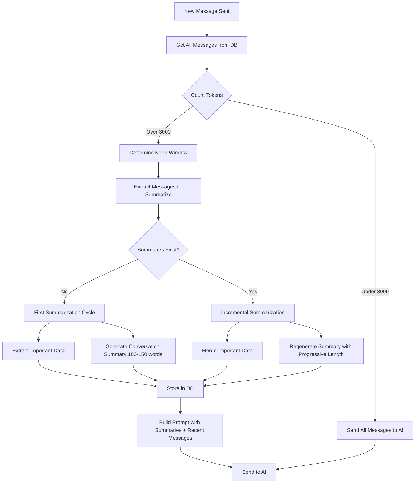

<!-- c4e0285e-a6dc-4dc5-96da-3d7d89de6393 6adfc15d-1fd8-49b6-84d3-aed571f7452f -->
# Memory Management and Compression System

## Overview

Implement a memory management system that compresses chat history for AI prompts while preserving all messages for UI display. System uses 3000 token threshold, keeps recent messages intact, and progressively summarizes older messages using GPT-4o-mini.

## Architecture

### Data Flow



### Database Schema Changes

Add `memory_compression` field to `chat_sessions` collection:

```json
{
  "memory_compression": {
    "important_data": {
      "user_preferences": {},
      "key_decisions": [],
      "important_facts": [],
      "source_urls": [],
      "document_structure": {},
      "entities": [],
      "custom_fields": {}
    },
    "conversation_summary": "narrative summary text",
    "summary_version": 1,
    "last_summarized_at": "2024-01-01T00:00:00Z",
    "messages_summarized_count": 10,
    "last_keep_window_index": 5
  }
}
```

## Phases

### Phase 1: Token Counting Infrastructure

**Objective**: Implement accurate token counting using tiktoken

**Changes**:

- Add `tiktoken` to `requirements.txt`
- Create `backend/services/memory_service.py` with token counting utilities
- Implement `count_tokens()` function using `gpt-4o-mini` encoding (cl100k_base)
- Add helper functions for counting tokens in messages, system prompts, and summaries

**Files to Modify**:

- `backend/requirements.txt` - Add tiktoken dependency
- `backend/services/memory_service.py` - New file with token counting

**Testing Instructions**:

1. Install dependencies: `pip install -r requirements.txt`
2. Start backend server
3. In Python shell or test script, test token counting:
   ```python
   from services.memory_service import count_tokens
   text = "This is a test message with some content."
   tokens = count_tokens(text)
   print(f"Tokens: {tokens}")
   # Should return accurate token count
   ```

4. Test with message array:
   ```python
   messages = [
       {"role": "user", "content": "Hello"},
       {"role": "assistant", "content": "Hi there! How can I help?"}
   ]
   total = count_tokens_for_messages(messages)
   print(f"Total tokens: {total}")
   ```

5. Verify token counts match OpenAI's tokenizer output (can cross-check with OpenAI API if needed)

---

### Phase 2: Database Schema and Memory Compression Model

**Objective**: Add memory_compression field to chat sessions and create model methods

**Changes**:

- Update `ChatSessionModel` in `backend/models/database.py`:
  - Add method to initialize `memory_compression` field
  - Add method to get memory compression data
  - Add method to update memory compression data
  - Add method to clear memory compression (optional, for testing)

**Files to Modify**:

- `backend/models/database.py` - Add memory compression methods to `ChatSessionModel`

**Testing Instructions**:

1. Create a test chat session:
   ```python
   from models.database import ChatSessionModel
   session_id = ChatSessionModel.create_session(user_id, project_id)
   ```

2. Initialize memory compression:
   ```python
   ChatSessionModel.initialize_memory_compression(session_id)
   ```

3. Verify in MongoDB that session has `memory_compression` field with proper structure
4. Test getting memory compression:
   ```python
   memory = ChatSessionModel.get_memory_compression(session_id)
   assert memory is not None
   assert "important_data" in memory
   assert "conversation_summary" in memory
   ```

5. Test updating memory compression:
   ```python
   updated_data = {
       "important_data": {"user_preferences": {"theme": "dark"}},
       "conversation_summary": "Test summary",
       "summary_version": 1
   }
   ChatSessionModel.update_memory_compression(session_id, updated_data)
   ```

6. Verify update persisted correctly in MongoDB

---

### Phase 3: Token Threshold Detection and Message Window Logic

**Objective**: Implement logic to detect when summarization is needed and determine which messages to keep

**Changes**:

- In `backend/services/memory_service.py`:
  - Add `should_summarize()` function that checks if total tokens exceed 3000
  - Add `determine_keep_window()` function that finds last N messages fitting in ~2000-3000 tokens
  - Add `get_messages_to_summarize()` function that returns messages before keep window
  - Add helper to estimate tokens including system prompt and summaries

**Files to Modify**:

- `backend/services/memory_service.py` - Add summarization decision logic

**Testing Instructions**:

1. Create a session with many messages (10+ messages to ensure >3000 tokens):
   ```python
   session_id = ChatSessionModel.create_session(user_id, project_id)
   for i in range(15):
       ChatSessionModel.add_message(session_id, "user", f"Message {i}: " + "word " * 200)
       ChatSessionModel.add_message(session_id, "assistant", f"Response {i}: " + "word " * 200)
   ```

2. Test threshold detection:
   ```python
   from services.memory_service import should_summarize
   messages = ChatSessionModel.get_messages(session_id)
   system_prompt = "You are a helpful assistant."
   should_sum = should_summarize(messages, system_prompt)
   assert should_sum == True  # Should be True after 15 messages
   ```

3. Test keep window determination:
   ```python
   from services.memory_service import determine_keep_window
   keep_window, keep_indices = determine_keep_window(messages, system_prompt, max_tokens=2500)
   print(f"Keep window: {len(keep_window)} messages")
   print(f"Keep indices: {keep_indices}")
   # Should return last 4-6 messages that fit in ~2500 tokens
   ```

4. Test getting messages to summarize:
   ```python
   from services.memory_service import get_messages_to_summarize
   to_summarize = get_messages_to_summarize(messages, keep_indices)
   print(f"Messages to summarize: {len(to_summarize)}")
   # Should return all messages except those in keep window
   ```

5. Test with small conversation (<3000 tokens):
   ```python
   session_id2 = ChatSessionModel.create_session(user_id, project_id)
   ChatSessionModel.add_message(session_id2, "user", "Hello")
   ChatSessionModel.add_message(session_id2, "assistant", "Hi!")
   messages2 = ChatSessionModel.get_messages(session_id2)
   should_sum2 = should_summarize(messages2, system_prompt)
   assert should_sum2 == False  # Should be False for short conversation
   ```


---

### Phase 4: Important Data Extraction Service

**Objective**: Implement GPT-4o-mini service to extract structured important data from messages

**Changes**:

- In `backend/services/memory_service.py`:
  - Add `extract_important_data()` function that calls GPT-4o-mini
  - Create prompt for structured data extraction (JSON format)
  - Implement merging logic for existing important data + new extraction
  - Handle edge cases (empty messages, no important data found)

**Prompt Structure for Important Data Extraction**:

```
You are extracting important structured data from a conversation that will be summarized.
Extract ONLY critical facts, preferences, decisions, and information that must be preserved.
Return valid JSON with this structure:
{
  "user_preferences": {},
  "key_decisions": [],
  "important_facts": [],
  "source_urls": [],
  "document_structure": {},
  "entities": [],
  "custom_fields": {}
}

Only include fields that have data. Be concise but comprehensive.
```

**Files to Modify**:

- `backend/services/memory_service.py` - Add important data extraction functions
- May need to import `OpenAIService` or create new client

**Testing Instructions**:

1. Create test messages with extractable data:
   ```python
   test_messages = [
       {"role": "user", "content": "I prefer dark mode. My document should have sections for Introduction, Methods, Results."},
       {"role": "assistant", "content": "Noted. I'll structure your document accordingly."},
       {"role": "user", "content": "Important sources: https://example.com/paper1, https://example.com/paper2"},
       {"role": "user", "content": "The key finding is that X causes Y. This is critical for the paper."}
   ]
   ```

2. Test extraction:
   ```python
   from services.memory_service import extract_important_data
   important_data = extract_important_data(test_messages)
   print(important_data)
   # Should extract:
   # - user_preferences: {"theme": "dark"}
   # - document_structure: {"sections": ["Introduction", "Methods", "Results"]}
   # - source_urls: ["https://example.com/paper1", "https://example.com/paper2"]
   # - important_facts: ["X causes Y"]
   ```

3. Test merging with existing data:
   ```python
   existing = {"important_data": {"user_preferences": {"theme": "dark"}, "source_urls": ["url1"]}}
   new_data = {"user_preferences": {"font": "arial"}, "source_urls": ["url2"]}
   merged = merge_important_data(existing["important_data"], new_data)
   # Should merge: theme and font in preferences, both URLs in source_urls (deduplicated)
   ```

4. Verify GPT-4o-mini API calls are working and responses are valid JSON
5. Test with empty messages (should return empty structure)

---

### Phase 5: Conversation Summary Generation Service

**Objective**: Implement progressive conversation summary generation with increasing word counts

**Changes**:

- In `backend/services/memory_service.py`:
  - Add `generate_conversation_summary()` function that calls GPT-4o-mini
  - Implement progressive word count calculation based on `summary_version`
  - Create prompt for narrative summary generation
  - Handle both first-time summarization and incremental summarization (new messages + old summary)

**Progressive Word Count Formula**:

- Version 1: 100-150 words
- Version 2: 200-250 words  
- Version 3: 300-350 words
- Version 4: 400-450 words
- Version 5+: 500-750 words (cap)

**Prompt Structure for Summary**:

```
Summarize this conversation history into a coherent narrative summary.
Focus on:
- Main topics discussed
- Key user requests and AI responses
- Important context and flow
- Any critical information for future reference

Keep it concise but comprehensive. Word count target: {target_words} words.

Previous summary (if exists): {previous_summary}
New messages to incorporate: {new_messages}

Create an updated summary that incorporates new messages while preserving important context from previous summary.
```

**Files to Modify**:

- `backend/services/memory_service.py` - Add summary generation functions

**Testing Instructions**:

1. Test first-time summary generation:
   ```python
   from services.memory_service import generate_conversation_summary
   messages = ChatSessionModel.get_messages(session_id)  # Use long conversation from Phase 3
   summary = generate_conversation_summary(messages, previous_summary=None, summary_version=1)
   print(f"Summary length: {len(summary)} characters")
   word_count = len(summary.split())
   print(f"Word count: {word_count}")
   # Should be approximately 100-150 words
   assert 100 <= word_count <= 150
   ```

2. Test progressive word counts:
   ```python
   # Version 2
   summary2 = generate_conversation_summary(messages, previous_summary=summary, summary_version=2)
   word_count2 = len(summary2.split())
   assert 200 <= word_count2 <= 250
   
   # Version 3
   summary3 = generate_conversation_summary(messages, previous_summary=summary2, summary_version=3)
   word_count3 = len(summary3.split())
   assert 300 <= word_count3 <= 350
   ```

3. Test incremental summarization (new messages + old summary):
   ```python
   old_summary = "Previous conversation about X and Y."
   new_messages = [
       {"role": "user", "content": "Now let's discuss Z"},
       {"role": "assistant", "content": "Sure, Z is related to X because..."}
   ]
   updated_summary = generate_conversation_summary(new_messages, previous_summary=old_summary, summary_version=2)
   # Should incorporate both old summary context and new messages
   assert "X" in updated_summary or "Y" in updated_summary  # Old context preserved
   assert "Z" in updated_summary  # New content added
   ```

4. Verify summary quality (readability, coherence, completeness)
5. Test with very long conversation (should still produce concise summary)

---

### Phase 6: Summarization Orchestration

**Objective**: Integrate summarization trigger and execution into message sending flow

**Changes**:

- Modify `backend/routes/chat.py` in `send_message()` function:
  - Before building messages array, check if summarization needed
  - If needed, call summarization orchestration function
  - Update memory compression in database after summarization
  - Build prompt with summaries + recent messages
- Create `orchestrate_summarization()` function in `memory_service.py` that:
  - Gets messages to summarize
  - Calls extraction and summary generation
  - Merges important data
  - Returns updated memory compression data

**Files to Modify**:

- `backend/routes/chat.py` - Add summarization check and orchestration in `send_message()`
- `backend/services/memory_service.py` - Add orchestration function

**Critical Logic**:

```python
def orchestrate_summarization(session_id, messages, system_prompt):
    # Check if we should summarize
    if not should_summarize(messages, system_prompt):
        return None  # No summarization needed
    
    # Get existing memory compression or initialize
    memory = ChatSessionModel.get_memory_compression(session_id) or initialize_memory_compression()
    
    # Determine keep window
    keep_window, keep_indices = determine_keep_window(messages, system_prompt, max_tokens=2500)
    messages_to_summarize = get_messages_to_summarize(messages, keep_indices)
    
    # If first time: summarize all old messages
    # If not first time: summarize new messages since last summary + old summary
    if memory["summary_version"] == 0:
        # First time - summarize all old messages
        important_data_new = extract_important_data(messages_to_summarize)
        summary_new = generate_conversation_summary(messages_to_summarize, None, summary_version=1)
    else:
        # Incremental - get messages since last summary
        messages_since_last = get_messages_since_last_summary(messages, memory["last_keep_window_index"])
        important_data_new = extract_important_data(messages_since_last)
        summary_new = generate_conversation_summary(messages_since_last, memory["conversation_summary"], memory["summary_version"] + 1)
    
    # Merge important data
    merged_important_data = merge_important_data(memory["important_data"], important_data_new)
    
    # Update memory compression
    updated_memory = {
        "important_data": merged_important_data,
        "conversation_summary": summary_new,
        "summary_version": memory["summary_version"] + 1,
        "last_summarized_at": datetime.utcnow().isoformat(),
        "messages_summarized_count": len(messages_to_summarize),
        "last_keep_window_index": keep_indices[0] if keep_indices else 0
    }
    
    return updated_memory
```

**Testing Instructions**:

1. Create a session and send many messages until >3000 tokens:
   ```python
   # Use API endpoint or direct function calls
   session_id = create_session(project_id)
   for i in range(20):
       send_message(session_id, f"User message {i}: " + "word " * 150)
       # Wait for response...
   ```

2. Check logs to verify summarization triggered after reaching threshold
3. Verify in MongoDB that `memory_compression` field was created and populated:
   ```python
   session = ChatSessionModel.get_session(session_id)
   memory = session.get("memory_compression")
   assert memory is not None
   assert memory["summary_version"] == 1
   assert len(memory["conversation_summary"]) > 0
   ```

4. Send more messages (should not trigger summarization again until ~3000 tokens):
   ```python
   # Send 5 more messages
   # Verify summarization NOT triggered (logs should show no summarization)
   ```

5. Continue sending until total tokens reach ~3000 again (may need ~10-15 more messages):
   ```python
   # Send enough messages to trigger second summarization cycle
   # Verify second summarization triggered
   # Check summary_version == 2
   # Check summary length increased (200-250 words)
   ```

6. Verify token count after summarization is well below 3000:
   ```python
   # After first summarization, count tokens of:
   # - System prompt
   # - Important data (serialized)
   # - Conversation summary
   # - Recent messages in keep window
   # Should be significantly below 3000 (target: <1000 for first time)
   ```


---

### Phase 7: Prompt Construction with Summaries

**Objective**: Modify message array construction to include summaries when they exist

**Changes**:

- Modify message array building in `backend/routes/chat.py`:
  - Check if memory compression exists
  - If summaries exist, prepend important data extract and conversation summary to messages
  - Format summaries appropriately for AI prompt
  - Ensure proper ordering: [System] -> [Important Data] -> [Summary] -> [Recent Messages]

**Prompt Format**:

```
[SYSTEM MESSAGE]
...
[IMPORTANT DATA FROM PREVIOUS CONVERSATIONS]
{important_data JSON formatted nicely}

[CONVERSATION SUMMARY]
{conversation_summary}

[RECENT MESSAGES]
{keep window messages}
```

**Files to Modify**:

- `backend/routes/chat.py` - Modify message array construction in `send_message()`

**Testing Instructions**:

1. After Phase 6, send a new message to a session that has summaries:
   ```python
   send_message(session_id, "New message after summarization")
   ```

2. Check logs/debug output to see prompt construction:

   - Should include important data section
   - Should include conversation summary
   - Should include recent messages (not all messages)
   - Should NOT include old messages that were summarized

3. Verify AI response is coherent and references context from summaries:
   ```python
   # AI should be able to reference previous conversation context
   # Even though old messages aren't in prompt, summaries provide context
   ```

4. Test with session without summaries (should work normally):
   ```python
   new_session = create_session(project_id)
   send_message(new_session, "First message")
   # Should send normally without summaries (no memory_compression exists yet)
   ```

5. Verify token count of final prompt:
   ```python
   # After summarization, final prompt should be <3000 tokens
   # System prompt (~500-1000) + Important data (~200-500) + Summary (~100-750) + Recent messages (~1500-2000) = <3000
   ```


---

### Phase 8: Error Handling and Edge Cases

**Objective**: Add robust error handling, edge case handling, and fallback mechanisms

**Changes**:

- Add error handling in summarization:
  - If GPT-4o-mini call fails, log error and fallback to sending all messages (degraded mode)
  - If token counting fails, use approximate estimation
  - If important data extraction fails, continue with empty important data
  - If summary generation fails, retry once or fallback
- Handle edge cases:
  - Empty messages array
  - Messages with very long content (single message >3000 tokens)
  - Memory compression data corruption (reset gracefully)
  - Concurrent summarization attempts (add locking or idempotency)

**Files to Modify**:

- `backend/services/memory_service.py` - Add error handling and fallbacks
- `backend/routes/chat.py` - Add error handling in summarization calls

**Testing Instructions**:

1. Test GPT-4o-mini API failure (simulate by using invalid API key temporarily):
   ```python
   # Should log error, fallback to sending all messages
   # Chat should still work (degraded mode)
   ```

2. Test with single very long message:
   ```python
   long_message = "word " * 2000  # Very long single message
   send_message(session_id, long_message)
   # Should handle gracefully (may need to truncate or handle differently)
   ```

3. Test with corrupted memory_compression data:
   ```python
   # Manually corrupt memory_compression in MongoDB
   # Send message - should handle gracefully, reset or fix
   ```

4. Test with empty messages array (edge case):
   ```python
   # Should not crash, should handle gracefully
   ```

5. Test concurrent requests (if possible):
   ```python
   # Send multiple messages rapidly to same session
   # Should handle race conditions in summarization
   ```


---

### Phase 9: Testing and Validation

**Objective**: Comprehensive end-to-end testing and validation

**Changes**:

- Create test scenarios covering all flows
- Validate token counts are accurate
- Validate summarization quality
- Validate important data preservation
- Performance testing (summarization should not significantly slow down requests)

**Testing Instructions**:

**Test Scenario 1: Short Conversation (No Summarization)**

1. Create new session
2. Send 5 messages total (user + assistant pairs)
3. Verify: No summarization triggered
4. Verify: All messages sent to AI normally
5. Verify: No memory_compression field created

**Test Scenario 2: First Summarization**

1. Create new session
2. Send messages until >3000 tokens (approximately 15-20 message pairs)
3. Verify: Summarization triggered on next message
4. Verify: memory_compression created with:

   - summary_version = 1
   - conversation_summary exists (~100-150 words)
   - important_data populated
   - last_summarized_at timestamp

5. Verify: Token count after summarization <1000
6. Send new message
7. Verify: Prompt includes summaries + recent messages only
8. Verify: AI response is coherent and references past context

**Test Scenario 3: Incremental Summarization**

1. Continue with session from Scenario 2
2. Send more messages until ~3000 tokens again (~10-15 more messages)
3. Verify: Second summarization triggered
4. Verify: summary_version = 2
5. Verify: Summary length increased (~200-250 words)
6. Verify: Important data merged (old + new data present)
7. Verify: Token count still <3000 after summarization

**Test Scenario 4: Important Data Preservation**

1. Create session, mention specific preferences/decisions:

   - "I prefer dark mode"
   - "Document structure: Intro, Methods, Results, Conclusion"
   - "Key sources: url1, url2"

2. Trigger summarization
3. Send new messages mentioning different topics
4. Trigger second summarization
5. Verify: Original preferences/decisions still in important_data
6. Verify: New information also added
7. Verify: No data loss

**Test Scenario 5: Token Accuracy**

1. Create session with known token count messages
2. Use tiktoken to manually calculate expected tokens
3. Compare with system's token count
4. Verify: Differences are minimal (<5% tolerance)

**Test Scenario 6: Performance**

1. Measure request time without summarization (baseline)
2. Measure request time when summarization triggers
3. Verify: Summarization adds reasonable delay (<5 seconds for GPT-4o-mini)
4. Verify: Subsequent requests (no summarization) are fast (similar to baseline)

**Test Scenario 7: UI Display**

1. Verify: All messages still displayed in UI correctly
2. Verify: Message history shows complete conversation
3. Verify: Summarization does not affect UI message display
4. Verify: Chat history retrieval API works correctly

**Test Scenario 8: Multiple Sessions**

1. Create multiple sessions
2. Trigger summarization in different sessions
3. Verify: Each session maintains separate memory_compression
4. Verify: No cross-session data leakage

---

## Implementation Notes

### Token Counting

- Use `tiktoken` with `cl100k_base` encoding (GPT-4o-mini uses this)
- Count tokens for: message content, role names, system prompt, summaries
- Account for OpenAI message formatting overhead (~4 tokens per message)

### Summarization Timing

- Summarization happens synchronously during message send (blocks request)
- Consider async summarization in future if performance becomes issue
- First summarization will add ~2-5 seconds to request time

### Important Data Structure

- Keep structure flexible with `custom_fields` for future expansion
- Important data should be deduplicated (especially URLs, entities)
- Arrays should maintain chronological order when relevant

### Progressive Summary Length

- Formula: `base_words = 100 + (version - 1) * 100` capped at 750
- Version 1: 100-150 words
- Version 2: 200-250 words
- Version 3: 300-350 words
- Version 4: 400-450 words  
- Version 5+: 500-750 words

### Error Handling Philosophy

- Fail gracefully - if summarization fails, fallback to sending all messages
- Log all errors for debugging
- Never lose user messages due to summarization errors
- Degraded mode should still work (may hit token limits but functional)