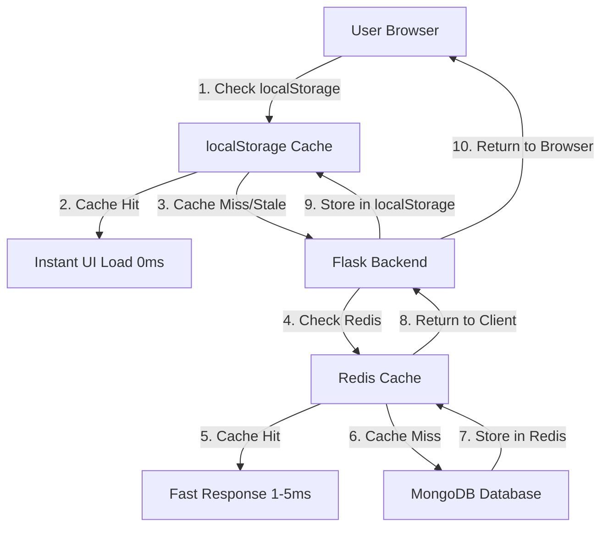

<!-- 838dbeb5-4347-4f47-87c1-7d4a6bfc10c2 1fa63a01-4d33-4344-9b2d-1db241426ced -->
# Multi-Layer Caching Implementation Plan

## Overview

Implement a production-ready multi-layer caching system to support 10,000+ users by reducing database load by 80-90% and improving response times by 10-20x. Remove word counter feature. System uses client-side (localStorage) for instant UI and server-side (Redis) for shared caching across all users.

## Architecture



## Phase 1: Remove Word Counter + Basic Client-Side Caching

### Goal

Remove word counter feature and implement basic localStorage caching for document/highlight/PDF lists to enable instant UI load on page refresh.

### Changes

#### 1.1 Remove Word Counter Feature

**Files to Modify:**

- [`frontend/src/components/DocumentPanel/DocumentPanel.js`](frontend/src/components/DocumentPanel/DocumentPanel.js)
- [`frontend/src/components/DocumentPanel/AddNewTabView.js`](frontend/src/components/DocumentPanel/AddNewTabView.js)

**Changes:**

- Remove `documentWordCounts` state and related logic
- Remove `fetchWordCountsForDocuments()` function (lines 554-573)
- Remove word count display from document cards
- Remove word count from `AddNewTabView` subtitle (line 121)
- Remove `getWordCount()` calls

**Debug Logging:**

```javascript
console.log('[CACHE] Word counter removed - no longer fetching document content for word counts');
```

#### 1.2 Implement localStorage Caching Utilities

**New File:** `frontend/src/utils/cache.js`

**Create cache utility functions:**

- `getCacheKey(type, projectId)` - Generate cache keys
- `getCachedData(key)` - Retrieve from localStorage
- `setCachedData(key, data, ttl)` - Store with TTL
- `isCacheValid(cachedData)` - Check if cache is still valid
- `clearCache(projectId)` - Clear all cache for a project
- `getCacheStats()` - Debug: Get cache statistics

**Cache Key Format:**

- `cache:documents:{projectId}`
- `cache:highlights:{projectId}`
- `cache:pdfs:{projectId}`
- `cache:lastSync:{projectId}` - Store last sync timestamp

**Debug Logging:**

```javascript
console.log('[CACHE] Cache key:', key);
console.log('[CACHE] Cache hit:', !!cachedData);
console.log('[CACHE] Cache age:', ageInSeconds, 'seconds');
console.log('[CACHE] Cache valid:', isValid);
```

#### 1.3 Implement Caching in DocumentPanel

**File:** [`frontend/src/components/DocumentPanel/DocumentPanel.js`](frontend/src/components/DocumentPanel/DocumentPanel.js)

**Modify `loadAvailableDocuments()` (line 537):**

1. Check localStorage cache first
2. If cache exists and valid (< 5 min old): Use cache, show UI immediately
3. Log: `[CACHE] Documents: Using cached data`
4. Fetch fresh data in background
5. Update cache with fresh data
6. If cache missing/stale: Fetch from API, then cache

**Modify `loadHighlightsForProject()` (line 631):**

- Same pattern: Check cache → Use if valid → Background refresh

**Modify `loadPdfsForProject()` (line 645):**

- Same pattern: Check cache → Use if valid → Background refresh

**Cache TTL:** 5 minutes (300 seconds)

**Debug Logging:**

```javascript
console.log('[CACHE] loadAvailableDocuments: Cache check');
console.log('[CACHE] loadAvailableDocuments: Cache hit, showing UI immediately');
console.log('[CACHE] loadAvailableDocuments: Fetching fresh data in background');
console.log('[CACHE] loadAvailableDocuments: Cache miss, fetching from API');
console.log('[CACHE] loadAvailableDocuments: Caching fresh data');
```

#### 1.4 Cache Invalidation on Mutations

**File:** [`frontend/src/components/DocumentPanel/DocumentPanel.js`](frontend/src/components/DocumentPanel/DocumentPanel.js)

**Invalidate cache when:**

- Document created: Clear `cache:documents:{projectId}`
- Document deleted: Clear `cache:documents:{projectId}`
- Document archived: Clear `cache:documents:{projectId}`
- Highlight saved: Clear `cache:highlights:{projectId}`
- PDF uploaded: Clear `cache:pdfs:{projectId}`

**Debug Logging:**

```javascript
console.log('[CACHE] Invalidating cache for project:', projectId);
console.log('[CACHE] Cleared cache keys:', keys);
```

### Testing Instructions (User)

**Phase 1 Testing:**

1. **Word Counter Removal:**

   - Open browser DevTools Console
   - Navigate to Research Documents tab
   - **Expected**: No word counts displayed on document cards
   - **Expected**: Console shows `[CACHE] Word counter removed`
   - **Expected**: No API calls to fetch document content for word counts

2. **Cache on Initial Load:**

   - Clear browser localStorage: `localStorage.clear()`
   - Reload page
   - **Expected**: Console shows `[CACHE] Cache miss, fetching from API`
   - **Expected**: Network tab shows API calls to `/api/document/research-documents`, `/api/highlights`, `/api/pdfs`
   - **Expected**: Data loads normally

3. **Cache on Reload (Cache Hit):**

   - Wait 2 seconds (don't reload yet)
   - Reload page (F5)
   - **Expected**: Console shows `[CACHE] Cache hit, showing UI immediately`
   - **Expected**: UI appears instantly (0ms delay)
   - **Expected**: Console shows `[CACHE] Fetching fresh data in background`
   - **Expected**: Network tab shows API calls happen AFTER UI is shown

4. **Cache Expiration:**

   - Wait 6 minutes (cache TTL is 5 minutes)
   - Reload page
   - **Expected**: Console shows `[CACHE] Cache expired, fetching from API`
   - **Expected**: Fresh data fetched from API

5. **Cache Invalidation:**

   - Create a new document
   - **Expected**: Console shows `[CACHE] Invalidating cache for project: {projectId}`
   - Reload page
   - **Expected**: Fresh data fetched (cache was cleared)

**Success Criteria:**

- Word counter completely removed
- UI loads instantly on reload (uses cache)
- Fresh data fetched in background
- Cache invalidates on mutations
- No console errors

---

## Phase 2: Server-Side Redis Caching

### Goal

Implement Redis caching on backend to reduce database load by 80-90% and improve response times by 10-20x for all users.

### Prerequisites

- Redis server available (AWS ElastiCache, Redis Cloud, or self-hosted)
- Redis connection details (host, port, password if needed)

### Changes

#### 2.1 Install Redis Client

**File:** [`backend/requirements.txt`](backend/requirements.txt)

**Add:**

```
redis>=5.0.0
```

**Install:**

```bash
pip install redis>=5.0.0
```

#### 2.2 Create Redis Service

**New File:** `backend/services/redis_service.py`

**Create Redis service:**

- `RedisService` class with connection management
- `get(key)` - Get cached data
- `set(key, value, ttl)` - Set cache with TTL
- `delete(key)` - Delete cache entry
- `delete_pattern(pattern)` - Delete all keys matching pattern
- `exists(key)` - Check if key exists
- Connection pooling for production

**Cache Key Format:**

- `cache:documents:{user_id}:{project_id}`
- `cache:highlights:{user_id}:{project_id}`
- `cache:pdfs:{user_id}:{project_id}`
- `cache:doc:{document_id}:meta`
- `cache:doc:{document_id}:version`

**TTL Configuration:**

- Lists (documents/highlights/pdfs): 5 minutes (300 seconds)
- Document metadata: 10 minutes (600 seconds)
- Document version: 1 minute (60 seconds)

**Debug Logging:**

```python
print(f"[REDIS] Connecting to Redis: {host}:{port}")
print(f"[REDIS] Cache get: {key}")
print(f"[REDIS] Cache hit: {key}")
print(f"[REDIS] Cache miss: {key}")
print(f"[REDIS] Cache set: {key}, TTL: {ttl}s")
print(f"[REDIS] Cache delete: {key}")
```

#### 2.3 Add Redis Configuration

**File:** [`backend/config.py`](backend/config.py)

**Add Redis configuration:**

```python
REDIS_HOST = os.getenv('REDIS_HOST', 'localhost')
REDIS_PORT = int(os.getenv('REDIS_PORT', 6379))
REDIS_PASSWORD = os.getenv('REDIS_PASSWORD', None)
REDIS_DB = int(os.getenv('REDIS_DB', 0))
REDIS_TTL_DOCUMENTS = int(os.getenv('REDIS_TTL_DOCUMENTS', 300))  # 5 min
REDIS_TTL_METADATA = int(os.getenv('REDIS_TTL_METADATA', 600))  # 10 min
REDIS_TTL_VERSION = int(os.getenv('REDIS_TTL_VERSION', 60))  # 1 min
```

#### 2.4 Implement Caching in Document Routes

**File:** [`backend/routes/document.py`](backend/routes/document.py)

**Modify `get_all_research_documents()` (line 413):**

1. Generate cache key: `cache:documents:{user_id}:{project_id}`
2. Check Redis cache first
3. If cache hit: Return cached data immediately
4. If cache miss: Fetch from MongoDB, cache result, return
5. Log cache hit/miss for monitoring

**Debug Logging:**

```python
print(f"[REDIS] get_all_research_documents: Checking cache for user {user_id}, project {project_id}")
print(f"[REDIS] get_all_research_documents: Cache hit")
print(f"[REDIS] get_all_research_documents: Cache miss, fetching from MongoDB")
print(f"[REDIS] get_all_research_documents: Cached {len(documents)} documents")
```

#### 2.5 Implement Caching in Highlight Routes

**File:** [`backend/routes/highlight.py`](backend/routes/highlight.py)

**Modify `get_highlights()` (line 215):**

- Same pattern: Check Redis → Return if hit → Fetch from MongoDB if miss → Cache result

**Debug Logging:**

```python
print(f"[REDIS] get_highlights: Cache key: cache:highlights:{user_id}:{project_id}")
print(f"[REDIS] get_highlights: Cache hit")
print(f"[REDIS] get_highlights: Cache miss, fetching from MongoDB")
```

#### 2.6 Implement Caching in PDF Routes

**File:** [`backend/routes/pdf.py`](backend/routes/pdf.py)

**Modify `get_pdfs()` (line 142):**

- Same pattern: Check Redis → Return if hit → Fetch from MongoDB if miss → Cache result

**Debug Logging:**

```python
print(f"[REDIS] get_pdfs: Cache key: cache:pdfs:{user_id}:{project_id}")
print(f"[REDIS] get_pdfs: Cache hit")
print(f"[REDIS] get_pdfs: Cache miss, fetching from MongoDB")
```

#### 2.7 Cache Invalidation on Mutations

**File:** [`backend/routes/document.py`](backend/routes/document.py)

**Invalidate cache when:**

- Document created: Delete `cache:documents:{user_id}:{project_id}`
- Document updated: Delete `cache:documents:{user_id}:{project_id}` and `cache:doc:{document_id}:*`
- Document deleted: Delete `cache:documents:{user_id}:{project_id}` and `cache:doc:{document_id}:*`
- Document archived: Delete `cache:documents:{user_id}:{project_id}`

**File:** [`backend/routes/highlight.py`](backend/routes/highlight.py)

**Invalidate on:**

- Highlight saved: Delete `cache:highlights:{user_id}:{project_id}`
- Highlight deleted: Delete `cache:highlights:{user_id}:{project_id}`

**File:** [`backend/routes/pdf.py`](backend/routes/pdf.py)

**Invalidate on:**

- PDF uploaded: Delete `cache:pdfs:{user_id}:{project_id}`
- PDF deleted: Delete `cache:pdfs:{user_id}:{project_id}`

**Debug Logging:**

```python
print(f"[REDIS] Invalidating cache: cache:documents:{user_id}:{project_id}")
print(f"[REDIS] Cache invalidated successfully")
```

### Testing Instructions (User)

**Phase 2 Testing:**

1. **Redis Connection:**

   - Start Redis server (or ensure cloud Redis is accessible)
   - Set environment variables: `REDIS_HOST`, `REDIS_PORT`, `REDIS_PASSWORD` (if needed)
   - Start Flask backend
   - **Expected**: Backend logs show `[REDIS] Connecting to Redis: {host}:{port}`
   - **Expected**: No connection errors

2. **Cache on First Request (Cache Miss):**

   - Clear browser localStorage: `localStorage.clear()`
   - Make request to `/api/document/research-documents?project_id={id}`
   - **Expected**: Backend logs show `[REDIS] Cache miss, fetching from MongoDB`
   - **Expected**: Backend logs show `[REDIS] Cached {N} documents`
   - **Expected**: Response time: 200-500ms (MongoDB query)

3. **Cache on Second Request (Cache Hit):**

   - Immediately make same request again
   - **Expected**: Backend logs show `[REDIS] Cache hit`
   - **Expected**: Response time: 1-5ms (Redis query)
   - **Expected**: 10-40x faster than first request

4. **Cache Invalidation:**

   - Create a new document via API
   - **Expected**: Backend logs show `[REDIS] Invalidating cache: cache:documents:{user_id}:{project_id}`
   - Make request to get documents
   - **Expected**: Backend logs show `[REDIS] Cache miss` (cache was cleared)
   - **Expected**: Fresh data returned

5. **Cache TTL Expiration:**

   - Make request (cache miss, then cached)
   - Wait 6 minutes (TTL is 5 minutes)
   - Make same request again
   - **Expected**: Backend logs show `[REDIS] Cache miss` (TTL expired)
   - **Expected**: Fresh data fetched from MongoDB

6. **Load Testing (Optional):**

   - Use tool like `ab` or `wrk` to send 100 concurrent requests
   - **Expected**: 80-90% cache hit rate after first request
   - **Expected**: Average response time: 10-20ms (vs 200-500ms without cache)

**Success Criteria:**

- Redis connection successful
- Cache hits return data in 1-5ms
- Cache misses fetch from MongoDB and cache result
- Cache invalidates on mutations
- 80-90% cache hit rate after warm-up
- No Redis connection errors

---

## Phase 3: Incremental Sync (updated_since)

### Goal

Implement incremental sync to fetch only changed items since last sync, reducing data transfer by 70-90%.

### Changes

#### 3.1 Add updated_since Parameter to Backend

**File:** [`backend/routes/document.py`](backend/routes/document.py)

**Modify `get_all_research_documents()` (line 413):**

- Accept `updated_since` query parameter (ISO 8601 timestamp)
- If provided: Filter documents where `updated_at > updated_since`
- Return only changed documents
- Include `last_updated` timestamp in response

**Debug Logging:**

```python
print(f"[SYNC] get_all_research_documents: updated_since={updated_since}")
print(f"[SYNC] Found {len(documents)} changed documents since {updated_since}")
```

**File:** [`backend/routes/highlight.py`](backend/routes/highlight.py)

**Modify `get_highlights()` (line 215):**

- Accept `updated_since` query parameter
- Filter highlights where `updated_at > updated_since`
- Return only changed highlights

**File:** [`backend/routes/pdf.py`](backend/routes/pdf.py)

**Modify `get_pdfs()` (line 142):**

- Accept `updated_since` query parameter
- Filter PDFs where `updated_at > updated_since`
- Return only changed PDFs

#### 3.2 Update Database Models

**File:** [`backend/models/database.py`](backend/models/database.py)

**Ensure all models have `updated_at` field indexed:**

- `ResearchDocumentModel.get_all_documents()` - Add index hint for `updated_at`
- `HighlightModel.get_highlights_by_project()` - Ensure `updated_at` filtering works
- `PDFDocumentModel.get_pdf_documents_by_project()` - Ensure `updated_at` filtering works

#### 3.3 Implement Incremental Sync in Frontend

**File:** [`frontend/src/components/DocumentPanel/DocumentPanel.js`](frontend/src/components/DocumentPanel/DocumentPanel.js)

**Modify `loadAvailableDocuments()` (line 537):**

1. Get `lastSync` timestamp from localStorage: `cache:lastSync:documents:{projectId}`
2. If cache exists: Send `updated_since={lastSync}` to API
3. Merge returned changes with cached data
4. Update `lastSync` timestamp
5. If no cache: Fetch all (normal behavior)

**Modify `loadHighlightsForProject()` (line 631):**

- Same pattern: Use `lastSync` for highlights

**Modify `loadPdfsForProject()` (line 645):**

- Same pattern: Use `lastSync` for PDFs

**Merge Logic:**

- For new items: Add to cache
- For updated items: Replace in cache
- For deleted items: Remove from cache (if API returns deleted IDs)

**Debug Logging:**

```javascript
console.log('[SYNC] Last sync:', lastSync);
console.log('[SYNC] Fetching changes since:', lastSync);
console.log('[SYNC] Received', changes.length, 'changed items');
console.log('[SYNC] Merging with cached data');
console.log('[SYNC] Updated last sync timestamp');
```

#### 3.4 Handle Deleted Items

**Backend:** Return deleted item IDs in response:

```json
{
  "documents": [...],
  "deleted": ["doc_id_1", "doc_id_2"],
  "last_updated": "2024-01-01T00:00:00Z"
}
```

**Frontend:** Remove deleted items from cache

**Debug Logging:**

```javascript
console.log('[SYNC] Removing deleted items:', deletedIds);
```

### Testing Instructions (User)

**Phase 3 Testing:**

1. **Initial Sync (No Cache):**

   - Clear localStorage: `localStorage.clear()`
   - Load documents
   - **Expected**: Console shows `[SYNC] No last sync, fetching all documents`
   - **Expected**: All documents fetched
   - **Expected**: `lastSync` timestamp saved in localStorage

2. **Incremental Sync (No Changes):**

   - Wait 2 seconds
   - Reload page
   - **Expected**: Console shows `[SYNC] Fetching changes since: {timestamp}`
   - **Expected**: API returns empty array (no changes)
   - **Expected**: No network traffic for unchanged data
   - **Expected**: UI shows cached data

3. **Incremental Sync (With Changes):**

   - Create a new document
   - Wait 2 seconds
   - Reload page
   - **Expected**: Console shows `[SYNC] Fetching changes since: {timestamp}`
   - **Expected**: API returns only the new document
   - **Expected**: Console shows `[SYNC] Received 1 changed items`
   - **Expected**: New document appears in list
   - **Expected**: Network transfer: ~1KB (vs ~10KB for full list)

4. **Incremental Sync (Updated Item):**

   - Edit an existing document
   - Wait 2 seconds
   - Reload page
   - **Expected**: API returns only the updated document
   - **Expected**: Updated document in list reflects changes
   - **Expected**: Other documents remain unchanged (from cache)

5. **Incremental Sync (Deleted Item):**

   - Delete a document
   - Wait 2 seconds
   - Reload page
   - **Expected**: API returns deleted document ID
   - **Expected**: Console shows `[SYNC] Removing deleted items: [doc_id]`
   - **Expected**: Document removed from list

6. **Data Transfer Comparison:**

   - Check Network tab for API response sizes
   - **Expected**: Incremental sync responses are 70-90% smaller than full sync
   - **Expected**: Faster response times (less data to transfer)

**Success Criteria:**

- Initial sync fetches all data
- Subsequent syncs fetch only changes
- Deleted items removed from cache
- 70-90% reduction in data transfer
- No data inconsistencies
- Cache stays in sync with server

---

## Phase 4: Document Content Caching with Version Checking

### Goal

Cache active document content with version checking to enable instant document load on page refresh.

### Changes

#### 4.1 Cache Document Content in Frontend

**File:** [`frontend/src/components/DocumentPanel/DocumentPanel.js`](frontend/src/components/DocumentPanel/DocumentPanel.js)

**Modify `fetchDocument()` (line 1244):**

1. Check localStorage cache: `cache:doc:{documentId}:content`
2. Get cached version from cache metadata
3. Send cached version to API: `GET /api/document?document_id={id}&version={cachedVersion}`
4. If server version matches: Return 304 Not Modified, use cached content
5. If server version differs: Fetch fresh content, update cache
6. If no cache: Fetch normally, cache result

**Cache Structure:**

```javascript
{
  content: "...",
  version: 123,
  updated_at: "2024-01-01T00:00:00Z",
  cached_at: "2024-01-01T00:00:00Z"
}
```

**Debug Logging:**

```javascript
console.log('[CACHE] fetchDocument: Checking cache for document:', documentId);
console.log('[CACHE] fetchDocument: Cached version:', cachedVersion);
console.log('[CACHE] fetchDocument: Server version:', serverVersion);
console.log('[CACHE] fetchDocument: Version match, using cached content');
console.log('[CACHE] fetchDocument: Version mismatch, fetching fresh content');
```

#### 4.2 Add Version Check to Backend

**File:** [`backend/routes/document.py`](backend/routes/document.py)

**Modify `get_document()` (line 21):**

- Accept `version` query parameter
- If provided: Compare with document's current version
- If versions match: Return 304 Not Modified
- If versions differ: Return full document with current version

**Debug Logging:**

```python
print(f"[CACHE] get_document: Client version: {client_version}, Server version: {server_version}")
print(f"[CACHE] get_document: Version match, returning 304")
print(f"[CACHE] get_document: Version mismatch, returning full document")
```

#### 4.3 Cache Active Document Only

**File:** [`frontend/src/components/DocumentPanel/DocumentPanel.js`](frontend/src/components/DocumentPanel/DocumentPanel.js)

**Cache Management:**

- Only cache content for currently active document
- Clear cache when document closes
- Limit cache size: Max 5MB total
- Evict oldest cache if limit exceeded

**Debug Logging:**

```javascript
console.log('[CACHE] Caching document content:', documentId, 'Size:', content.length);
console.log('[CACHE] Clearing document cache:', documentId);
console.log('[CACHE] Cache size limit reached, evicting oldest');
```

#### 4.4 Update Cache on Delta Save

**File:** [`frontend/src/components/DocumentPanel/DocumentPanel.js`](frontend/src/components/DocumentPanel/DocumentPanel.js)

**Modify `performSave()` (line 1478):**

- After successful save: Update cached content with new version
- Update `cached_at` timestamp
- Store new content in cache

**Debug Logging:**

```javascript
console.log('[CACHE] Updating document cache after save:', documentId, 'Version:', newVersion);
```

### Testing Instructions (User)

**Phase 4 Testing:**

1. **Cache on Document Open:**

   - Open a document
   - **Expected**: Console shows `[CACHE] fetchDocument: Cache miss, fetching from API`
   - **Expected**: Document loads normally
   - **Expected**: Content cached in localStorage

2. **Cache on Reload (Version Match):**

   - Reload page (document should auto-open from localStorage tab state)
   - **Expected**: Console shows `[CACHE] fetchDocument: Cached version: {N}`
   - **Expected**: Console shows `[CACHE] fetchDocument: Version match, using cached content`
   - **Expected**: Document loads instantly (0ms delay)
   - **Expected**: Network tab shows 304 Not Modified response

3. **Cache on Reload (Version Mismatch):**

   - Open document in another browser/tab
   - Edit document in other browser
   - Reload original browser
   - **Expected**: Console shows `[CACHE] fetchDocument: Version mismatch, fetching fresh content`
   - **Expected**: Fresh content loaded
   - **Expected**: Cache updated with new version

4. **Cache Update on Save:**

   - Edit document
   - Wait for auto-save (3 seconds)
   - **Expected**: Console shows `[CACHE] Updating document cache after save`
   - **Expected**: Cache updated with new content and version
   - Reload page
   - **Expected**: Latest content loaded from cache

5. **Cache Eviction:**

   - Open 10+ documents (to exceed 5MB limit)
   - **Expected**: Console shows `[CACHE] Cache size limit reached, evicting oldest`
   - **Expected**: Oldest document cache removed
   - **Expected**: New document cached

**Success Criteria:**

- Document content cached on open
- Instant load on reload if version matches
- Fresh content fetched if version differs
- Cache updated after saves
- Cache eviction works correctly
- No memory issues

---

## Phase 5: Optimization and Fine-Tuning

### Goal

Fine-tune cache TTLs, add monitoring, optimize cache keys, and add cache statistics.

### Changes

#### 5.1 Add Cache Statistics Endpoint

**File:** [`backend/routes/document.py`](backend/routes/document.py)

**New endpoint:** `GET /api/cache/stats`

- Return cache hit/miss rates
- Return cache size
- Return most cached keys
- Return TTL information

**Debug Logging:**

```python
print(f"[CACHE STATS] Hit rate: {hit_rate}%")
print(f"[CACHE STATS] Total keys: {total_keys}")
print(f"[CACHE STATS] Memory usage: {memory_usage}MB")
```

#### 5.2 Add Cache Warming

**File:** [`backend/routes/document.py`](backend/routes/document.py)

**Optional:** Pre-warm cache for active projects

- Background job to cache frequently accessed data
- Run every 5 minutes
- Cache top 10 most active projects

#### 5.3 Optimize Cache Keys

**Review and optimize:**

- Use shorter keys where possible
- Use consistent naming
- Document key format in code comments

#### 5.4 Add Cache Monitoring

**Frontend:** Add cache statistics to console

```javascript
console.log('[CACHE STATS]', {
  hitRate: '85%',
  totalKeys: 150,
  cacheSize: '2.5MB',
  oldestCache: '5 minutes ago'
});
```

**Backend:** Log cache performance metrics

```python
print(f"[CACHE METRICS] Average response time: {avg_time}ms")
print(f"[CACHE METRICS] Cache hit rate: {hit_rate}%")
```

#### 5.5 Fine-Tune TTLs

**Based on usage patterns, adjust:**

- Document lists: 5 minutes (current)
- Highlights: 5 minutes (current)
- PDFs: 5 minutes (current)
- Document metadata: 10 minutes (current)
- Document version: 1 minute (current)

**Make TTLs configurable via environment variables**

### Testing Instructions (User)

**Phase 5 Testing:**

1. **Cache Statistics:**

   - Make several API requests
   - Check cache stats endpoint: `GET /api/cache/stats`
   - **Expected**: Returns hit/miss rates, cache size, key count
   - **Expected**: Hit rate increases over time (cache warming)

2. **Performance Monitoring:**

   - Check backend logs for cache metrics
   - **Expected**: Average response time decreases over time
   - **Expected**: Cache hit rate stabilizes at 80-90%

3. **Load Testing:**

   - Send 100 concurrent requests
   - **Expected**: 80-90% cache hit rate
   - **Expected**: Average response time: 10-20ms
   - **Expected**: Database load: 10-20% of requests (80-90% reduction)

4. **Cache Warming (if implemented):**

   - Wait 5 minutes
   - **Expected**: Backend logs show cache warming for active projects
   - **Expected**: First request after warm-up is cache hit

5. **TTL Configuration:**

   - Change TTL via environment variable
   - Restart backend
   - **Expected**: New TTL applied
   - **Expected**: Cache expires at new interval

**Success Criteria:**

- Cache statistics available
- Hit rate: 80-90%
- Average response time: 10-20ms
- Database load: 80-90% reduction
- TTLs configurable
- No performance degradation

---

## Implementation Notes

### Debug Logging Removal

After each phase is tested and confirmed working, remove verbose debug logs but keep:

- Error logs
- Performance metrics
- Cache hit/miss rates (for monitoring)

### Error Handling

- Redis connection failures: Fall back to MongoDB (degrade gracefully)
- localStorage quota exceeded: Clear oldest cache, log warning
- Cache corruption: Clear cache, fetch fresh data

### Security Considerations

- Cache keys include user_id to prevent cross-user data leaks
- Validate user_id on all cached data
- Never cache sensitive data (passwords, tokens)

### Performance Targets

- Client-side cache: 0ms (instant UI)
- Redis cache hit: 1-5ms response time
- MongoDB query: 200-500ms response time
- Cache hit rate: 80-90%
- Database load reduction: 80-90%

---

## Success Metrics

**Phase 1:**

- Word counter removed
- UI loads instantly on reload (0ms)
- Background refresh works

**Phase 2:**

- Redis caching operational
- Cache hit rate: 80-90%
- Response time: 1-5ms for cache hits

**Phase 3:**

- Incremental sync working
- Data transfer: 70-90% reduction
- Cache stays in sync

**Phase 4:**

- Document content cached
- Instant document load on reload
- Version checking works

**Phase 5:**

- Cache statistics available
- Performance optimized
- Production-ready

---

## Rollback Plan

If issues occur:

1. **Phase 1-2:** Disable caching via feature flag, fall back to direct DB queries
2. **Phase 3:** Disable incremental sync, use full sync
3. **Phase 4:** Disable content caching, always fetch from server
4. **Phase 5:** Revert TTL changes, use defaults

All phases are backward compatible - can disable individually without breaking functionality.

### To-dos

- [ ] Remove word counter feature from DocumentPanel and AddNewTabView components
- [ ] Create cache utility functions in frontend/src/utils/cache.js
- [ ] Implement localStorage caching in DocumentPanel for documents, highlights, and PDFs
- [ ] Implement cache invalidation on document/highlight/PDF mutations
- [ ] Set up Redis service and configuration in backend
- [ ] Implement Redis caching in document, highlight, and PDF routes
- [ ] Implement Redis cache invalidation on mutations
- [ ] Add updated_since parameter to backend list endpoints
- [ ] Implement incremental sync in frontend with lastSync timestamps
- [ ] Implement document content caching with version checking in frontend
- [ ] Add version checking to backend get_document endpoint
- [ ] Add cache statistics, monitoring, and fine-tune TTLs