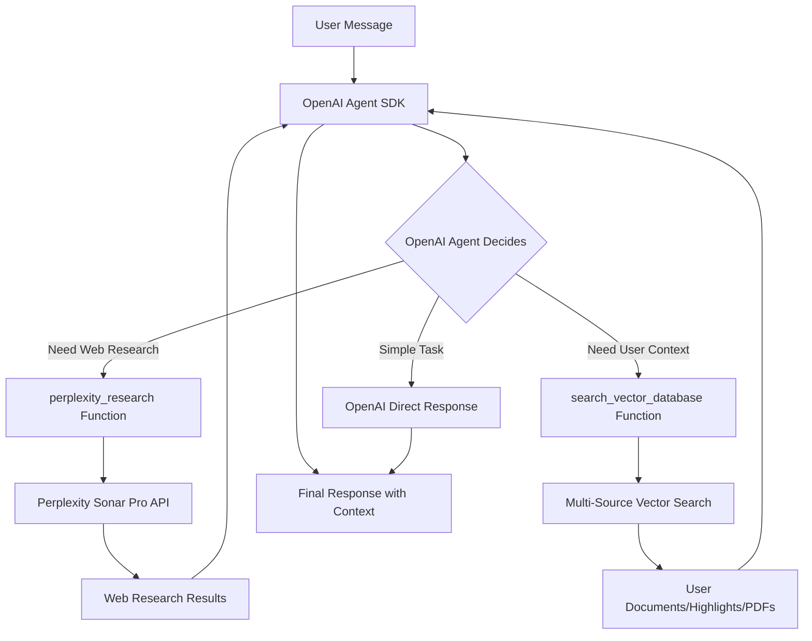

<!-- bf434c19-0924-4fda-8e7a-60be6abfc0c2 98e1e820-b082-4fc0-a734-26e7899103e0 -->
# OpenAI Agent with Perplexity Tool Integration Plan

## Overview

This plan implements an agentic framework using OpenAI Agents SDK where **OpenAI is the main agent** that intelligently decides when to call Perplexity Sonar Pro for web research versus handling queries directly. Perplexity becomes a function tool alongside vector database search. This provides better cost control, flexibility, and intelligent routing.

## Architecture

## Phase 0: OpenAI Agent Framework Setup

### Goal

Set up OpenAI Agents SDK with OpenAI as the main agent, Perplexity Sonar Pro as a research function tool, and vector database search as a context function tool.

### Tasks

#### 0.1 Install Dependencies

- Add to `backend/requirements.txt`:
  - `openai-agents>=0.1.0` (or latest compatible version)
  - `nest-asyncio>=1.5.0` (for async support in Flask)

#### 0.2 Create Agentic Service

- Create `backend/services/agentic_openai_service.py`:
  - Initialize `AsyncOpenAI` client pointing to OpenAI API (default endpoint)
  - Create `perplexity_research()` function tool that:
    - Takes a query string parameter
    - Calls Perplexity Sonar Pro API via `AsyncOpenAI` client pointing to `https://api.perplexity.ai`
    - Returns research results with citations
  - Create `search_vector_database()` function tool (for now, calls existing `vector_service.search_relevant_chunks`)
  - Create `create_agent()` function that:
    - Builds Agent with OpenAI model (GPT-4o-mini for cost-effectiveness, or GPT-4o for better reasoning)
    - Includes both function tools
    - Uses system instructions for intelligent tool routing
  - Create `chat_completion_agentic()` async function that runs the agent

#### 0.3 Preserve Current System Prompts

- Ensure `backend/prompts/ORIGINAL_SYSTEM_PROMPTS.md` exists:
  - Document current `system_message_write` from `chat.py`
  - Document current `system_message_research` from `chat.py`
  - Include revision context logic

#### 0.4 Create Simplified System Prompts (Phase 0)

- Create `backend/prompts/SIMPLIFIED_PROMPTS_PHASE_0.md`:
  - **Write Mode Prompt**:
    - Basic instructions for content generation
    - Tool usage guidelines:
      - Use `search_vector_database` when user asks about their documents, highlights, or saved content
      - Use `perplexity_research` when user asks questions requiring current web information, research, or citations
      - For simple tasks like summaries or explanations of general knowledge, respond directly without calling tools
    - JSON format requirements
  - **Research Mode Prompt**:
    - Conversational instructions
    - Tool usage guidelines (same as write mode)
    - JSON format with `document_content` always empty

#### 0.5 Update Chat Route for Async

- Modify `backend/routes/chat.py`:
  - Update `send_message()` route to be async (Flask 3.0+ supports async)
  - Replace direct `perplexity_service.chat_completion()` call with `agentic_openai_service.chat_completion_agentic()`
  - Handle async response properly
  - Update to use simplified prompts from Phase 0
  - Remove Perplexity-specific message alternation logic (OpenAI doesn't require it)

#### 0.6 Create Perplexity Function Tool Implementation

- In `backend/services/agentic_openai_service.py`:
  - Implement `perplexity_research()` function tool:
    - Accept `query: str` parameter with description: "The research question or topic that requires web search, current information, or citations"
    - Create separate `AsyncOpenAI` client for Perplexity: `AsyncOpenAI(base_url="https://api.perplexity.ai", api_key=Config.PERPLEXITY_API_KEY)`
    - Call Perplexity Sonar Pro: `client.chat.completions.create(model="sonar-pro", messages=[{"role": "user", "content": query}])`
    - Extract response content and citations
    - Return formatted string: `"Research Results: {content}\n\nSources: {citations}"`
  - Add error handling for Perplexity API failures

### Test Scenarios (Phase 0)

#### Test 0.1: OpenAI Handles Simple Task Directly

- **Query**: "Summarize quantum entanglement in one paragraph"
- **Expected**: OpenAI agent responds directly without calling any tools
- **Verify**: Logs show no function calls, response is generated by OpenAI directly

#### Test 0.2: OpenAI Calls Perplexity for Research

- **Query**: "What are the latest developments in AI safety research in 2024?"
- **Expected**: Agent calls `perplexity_research()` function, receives web research results, includes in response
- **Verify**: Logs show `perplexity_research` function call occurred, response includes citations

#### Test 0.3: OpenAI Calls Vector Search for User Content

- **Setup**: Create a test document with known content, index it
- **Query**: "What did I write about machine learning?"
- **Expected**: Agent calls `search_vector_database()` function, retrieves relevant chunks, includes in response
- **Verify**: Logs show `search_vector_database` function call occurred, response references document content

#### Test 0.4: OpenAI Uses Multiple Tools

- **Setup**: Create a document about "AI ethics"
- **Query**: "What did I write about AI ethics, and what are the latest research papers on this topic?"
- **Expected**: Agent calls both `search_vector_database()` and `perplexity_research()`, combines results
- **Verify**: Logs show both function calls, response combines user content and web research

#### Test 0.5: Intelligent Tool Selection

- **Query 1**: "Hello, how are you?" (no tools needed)
- **Expected**: Agent responds directly, no function calls
- **Query 2**: "Explain photosynthesis" (general knowledge, no tools needed)
- **Expected**: Agent responds directly, no function calls
- **Query 3**: "What are the latest news about X?" (needs web search)
- **Expected**: Agent calls `perplexity_research()`
- **Verify**: Logs show appropriate tool selection for each query

#### Test 0.6: Research Mode Conversation

- **Mode**: Research
- **Query**: "Tell me about neural networks and find current research"
- **Expected**: Conversational response with web research, `document_content` is empty string
- **Verify**: No function call to vector database unless user asks about their content, `document_content` is empty

## Phase I: Multi-Source Vectorization

### Goal

Add vectorization for highlights, full PDF text, and full image OCR text. Enhance vector search to support all source types.

### Tasks

#### I.1 Enhance DocumentEmbeddingModel Schema

- Update `backend/models/database.py`:
  - Modify `DocumentEmbeddingModel.create_embedding()` to accept:
    - `source_type`: 'research_document', 'highlight', 'pdf', 'image_ocr'
    - `source_id`: highlight_id, pdf_id, image_id, document_id
    - `project_id`: for filtering
    - `user_id`: for user isolation
  - Update metadata structure to include source-specific fields

#### I.2 Update VectorService

- Modify `backend/services/vector_service.py`:
  - Add `index_highlight()` method: index highlight text + note
  - Add `index_pdf_full_text()` method: extract full PDF text using PyMuPDF's `get_text()`, chunk and index
  - Add `index_image_ocr()` method: run full OCR on image, chunk and index
  - Update `search_relevant_chunks()` to:
    - Accept optional `source_types` filter (list of source types)
    - Accept optional `project_id` filter
    - Return results with `source_type` and `source_id` metadata
    - Search across all source types by default

#### I.3 Add PDF Text Extraction

- Update `backend/services/pdf_extraction_service.py`:
  - Add `extract_full_text()` method:
    - Use PyMuPDF: `page.get_text()` for each page
    - Combine all pages into single text
    - Return full text string
- Update `backend/routes/pdf.py`:
  - In `extract_highlights_async()`, after highlight extraction:
    - Call `extract_full_text()` on PDF
    - Call `vector_service.index_pdf_full_text(pdf_id, full_text, user_id, project_id)`

#### I.4 Add Image OCR Extraction

- Update `backend/services/ocr_position_service.py`:
  - Add `extract_full_text()` method:
    - Run Tesseract OCR on entire image: `pytesseract.image_to_string(img)`
    - Return full OCR text
- Update `backend/routes/pdf.py`:
  - In `extract_highlights_async()`, for image uploads:
    - Call `ocr_service.extract_full_text()` on image
    - Call `vector_service.index_image_ocr(image_id, ocr_text, user_id, project_id)`

#### I.5 Index Highlights on Save

- Update `backend/routes/highlight.py`:
  - In `save_highlight()` route, after saving highlight:
    - Combine `highlight_text` + `note` (if exists)
    - Call `vector_service.index_highlight(highlight_id, combined_text, user_id, project_id, source_url)`
- Update `backend/routes/pdf.py`:
  - In `update_highlights()` method, after saving each highlight:
    - Index each highlight individually

#### I.6 Update Agentic Service for Multi-Source Search

- Update `backend/services/agentic_openai_service.py`:
  - Enhance `search_vector_database()` function tool:
    - Accept optional `source_types` parameter (default: all sources)
    - Accept `project_id` from agent context
    - Call `vector_service.search_relevant_chunks()` with filters
    - Format results to show source type and metadata
    - Include source URLs/identifiers in response

#### I.7 Create Simplified System Prompts (Phase I)

- Create `backend/prompts/SIMPLIFIED_PROMPTS_PHASE_I.md`:
  - Write mode: Basic instructions + function calling hints for multi-source search
  - Research mode: Basic instructions + function calling hints
  - Update `chat.py` to use Phase I simplified prompts

### Test Scenarios (Phase I)

#### Test I.1: Highlight Vectorization

- **Setup**: Save a highlight with text "Machine learning is revolutionizing AI"
- **Action**: Wait for indexing to complete
- **Query**: "What did I highlight about machine learning?"
- **Expected**: Agent calls `search_vector_database()`, finds highlight, includes in response
- **Verify**: Response mentions highlight text, indicates it came from a highlight

#### Test I.2: PDF Full Text Vectorization

- **Setup**: Upload PDF with text "Deep learning requires large datasets"
- **Action**: Wait for extraction and indexing
- **Query**: "What did the PDF say about deep learning?"
- **Expected**: Agent finds PDF text content (not just highlights)
- **Verify**: Response includes content from PDF full text, indicates PDF source

#### Test I.3: Image OCR Vectorization

- **Setup**: Upload image with text "Natural language processing enables chatbots"
- **Action**: Wait for OCR and indexing
- **Query**: "What text was in the uploaded image?"
- **Expected**: Agent finds OCR text content
- **Verify**: Response includes OCR text, indicates image OCR source

#### Test I.4: Multi-Source Search

- **Setup**: 
  - Document: "AI is transforming industries"
  - Highlight: "Machine learning is key"
  - PDF: "Deep learning requires GPUs"
- **Query**: "What did I save about AI and machine learning?"
- **Expected**: Agent searches all sources, returns relevant chunks from multiple sources
- **Verify**: Response includes content from document, highlight, and/or PDF

#### Test I.5: Source Type Filtering

- **Setup**: Create highlights and documents with similar content
- **Query**: "What highlights did I save about topic X?" (implicit filter to highlights)
- **Expected**: Agent only searches highlights, ignores documents
- **Verify**: Response only includes highlight content

#### Test I.6: Function Calling Decision Making

- **Query 1**: "Hello, how are you?" (no context needed)
- **Expected**: Agent does NOT call function, responds directly
- **Query 2**: "What did I write about X?" (needs context)
- **Expected**: Agent calls `search_vector_database()` first, then responds
- **Verify**: Logs show function call decision making

## Phase II: Rich System Prompts

### Goal

Enhance system prompts with detailed instructions for function calling, content generation, and multi-source RAG strategies.

### Tasks

#### II.1 Create Rich System Prompts

- Create `backend/prompts/RICH_PROMPTS_PHASE_II.md`:
  - **Write Mode Prompt**:
    - Detailed function calling strategy:
      - When to call `search_vector_database` (questions about user's saved content)
      - When to call `perplexity_research` (questions requiring current information, web search, or research)
      - When to respond directly (simple tasks, general knowledge explanations)
    - Multi-source RAG instructions (combine document, highlights, PDFs, OCR)
    - Content generation guidelines (markdown formatting, structure)
    - Source attribution rules
    - Revision handling (existing revision context logic)
  - **Research Mode Prompt**:
    - Function calling for context retrieval and research
    - Multi-source synthesis instructions
    - Conversation guidelines with source references
    - Research assistance best practices

#### II.2 Update Chat Route with Rich Prompts

- Update `backend/routes/chat.py`:
  - Replace simplified prompts with rich prompts from Phase II
  - Preserve revision context logic
  - Add source type hints in prompts

#### II.3 Enhance Agent Instructions

- Update `backend/services/agentic_openai_service.py`:
  - Include rich instructions in agent creation
  - Add examples of when to call functions
  - Include multi-source RAG strategy in instructions

### Test Scenarios (Phase II)

#### Test II.1: Intelligent Function Calling

- **Query**: "Summarize what I've written and highlighted about topic X, and find the latest research papers"
- **Expected**: Agent calls both `search_vector_database()` and `perplexity_research()`, synthesizes from multiple sources
- **Verify**: Response synthesizes content from document and highlights, includes web research citations

#### Test II.2: Source Attribution

- **Query**: "Tell me about topic Y"
- **Expected**: Response distinguishes between document content, highlights, PDF content, OCR text, and web research
- **Verify**: Response indicates source types in natural language ("From your highlights...", "According to recent research...")

#### Test II.3: Context-Aware Content Generation

- **Setup**: Existing document with "Introduction: AI basics"
- **Query**: "Add a section on machine learning after the introduction"
- **Expected**: Agent calls function to get document context, generates content that fits after introduction
- **Verify**: Generated content is contextual and properly formatted

#### Test II.4: Multi-Source Synthesis

- **Setup**: Document, highlight, and PDF all mention different aspects of same topic
- **Query**: "Write a comprehensive section on topic Z using all my sources and latest research"
- **Expected**: Agent retrieves from all sources, calls Perplexity for web research, synthesizes coherent content
- **Verify**: Response combines information from all source types plus web research

#### Test II.5: Research Mode with Sources

- **Mode**: Research
- **Query**: "What do my highlights say about X, and what does the PDF say? Also find recent papers."
- **Expected**: Conversational response that references both highlights and PDF, includes web research, `document_content` is empty
- **Verify**: Response is conversational but well-sourced, no content generation

## Implementation Files

### New Files

- `backend/services/agentic_openai_service.py` - Agentic service with OpenAI as main agent and Perplexity as tool
- `backend/prompts/ORIGINAL_SYSTEM_PROMPTS.md` - Preservation of current prompts (if not exists)
- `backend/prompts/SIMPLIFIED_PROMPTS_PHASE_0.md` - Minimal prompts for Phase 0 with tool routing guidelines
- `backend/prompts/SIMPLIFIED_PROMPTS_PHASE_I.md` - Basic prompts with function hints for multi-source
- `backend/prompts/RICH_PROMPTS_PHASE_II.md` - Detailed prompts with full instructions

### Modified Files

- `backend/requirements.txt` - Add agentic dependencies (`openai-agents`, `nest-asyncio`)
- `backend/models/database.py` - Enhance DocumentEmbeddingModel schema (Phase I)
- `backend/services/vector_service.py` - Add multi-source indexing and search (Phase I)
- `backend/services/pdf_extraction_service.py` - Add full PDF text extraction (Phase I)
- `backend/services/ocr_position_service.py` - Add full OCR text extraction (Phase I)
- `backend/routes/chat.py` - Make async, use agentic service, update prompts (Phase 0)
- `backend/routes/pdf.py` - Add vectorization on upload/extraction (Phase I)
- `backend/routes/highlight.py` - Add vectorization on highlight save (Phase I)

## Configuration Changes

- Ensure `OPENAI_API_KEY` is set in environment (for main agent)
- Ensure `PERPLEXITY_API_KEY` is set in environment (for research tool)
- OpenAI model choice: Use `gpt-4o-mini` for cost-effectiveness, or `gpt-4o` for better reasoning
- Perplexity model: Use `sonar-pro` for research tool

## Testing Strategy

### Manual Testing

- Test scenarios above for each phase
- Verify function calling logs show intelligent tool selection
- Verify vector search results include correct source types
- Verify Perplexity research tool returns citations
- Verify response quality and cost efficiency

### Cost Monitoring

- Track OpenAI API usage (should be cheaper for simple queries)
- Track Perplexity API usage (should only be called when research is needed)
- Compare costs before/after implementation

## Dependencies

- `openai-agents>=0.1.0` (or latest)
- `nest-asyncio>=1.5.0`
- Existing: `openai>=1.3.0`, `perplexityai>=0.22.0`, `pymupdf>=1.23.0`, `pytesseract>=0.3.10`

## Success Criteria

- Phase 0: OpenAI agent successfully routes queries intelligently, calls Perplexity only when needed
- Phase I: All source types (documents, highlights, PDFs, OCR) are vectorized and searchable
- Phase II: Agent intelligently uses multi-source context and web research, generates high-quality responses with proper source attribution

## Key Advantages of This Approach

1. **Cost Efficiency**: OpenAI handles simple queries directly, Perplexity only called for research
2. **Intelligent Routing**: Agent decides when web research is truly needed
3. **Flexibility**: Easy to add more tools (e.g., database queries, API integrations)
4. **Better User Experience**: Faster responses for simple queries, comprehensive research when needed
5. **Maintainability**: Clear separation between reasoning (OpenAI) and tools (Perplexity, vector search)

## To-dos

- [ ] Install dependencies: openai-agents and nest-asyncio
- [ ] Create agentic_openai_service.py with OpenAI as main agent
- [ ] Implement perplexity_research function tool with Perplexity Sonar Pro
- [ ] Implement search_vector_database function tool
- [ ] Preserve current system prompts in ORIGINAL_SYSTEM_PROMPTS.md
- [ ] Create SIMPLIFIED_PROMPTS_PHASE_0.md with tool routing guidelines
- [ ] Update chat.py send_message route to async and use agentic service
- [ ] Remove Perplexity-specific message alternation logic
- [ ] Run Phase 0 test scenarios (intelligent routing, tool selection, multi-tool usage)
- [ ] Enhance DocumentEmbeddingModel to support source_type, source_id, project_id, user_id (Phase I)
- [ ] Add index_highlight(), index_pdf_full_text(), index_image_ocr() methods to VectorService (Phase I)
- [ ] Add extract_full_text() method to pdf_extraction_service.py using PyMuPDF get_text() (Phase I)
- [ ] Add extract_full_text() method to ocr_position_service.py using pytesseract (Phase I)
- [ ] Update pdf.py to index full PDF text after highlight extraction (Phase I)
- [ ] Update pdf.py to index full OCR text for image uploads (Phase I)
- [ ] Update highlight.py and pdf.py to index highlights on save (Phase I)
- [ ] Update search_relevant_chunks() to support source_types filter and multi-source search (Phase I)
- [ ] Enhance search_vector_database function tool to support source filtering (Phase I)
- [ ] Create SIMPLIFIED_PROMPTS_PHASE_I.md with function calling hints (Phase I)
- [ ] Run Phase I test scenarios (highlight, PDF, OCR vectorization, multi-source search) (Phase I)
- [ ] Create RICH_PROMPTS_PHASE_II.md with detailed instructions for function calling and multi-source RAG (Phase II)
- [ ] Update chat.py to use rich prompts from Phase II (Phase II)
- [ ] Enhance agent creation with rich instructions and examples (Phase II)
- [ ] Run Phase II test scenarios (intelligent function calling, source attribution, synthesis) (Phase II)

### To-dos

- [ ] Install dependencies: openai-agents and nest-asyncio
- [ ] Create agentic_openai_service.py with OpenAI as main agent, Perplexity as research tool, and vector search as context tool
- [ ] Create SIMPLIFIED_PROMPTS_PHASE_0.md with tool routing guidelines (when to use Perplexity vs direct response vs vector search)
- [ ] Update chat.py send_message route to async and use agentic_openai_service instead of perplexity_service
- [ ] Run Phase 0 test scenarios: intelligent routing, Perplexity tool calls, vector search tool calls, multi-tool usage
- [ ] Enhance DocumentEmbeddingModel to support source_type, source_id, project_id, user_id metadata
- [ ] Add index_highlight(), index_pdf_full_text(), index_image_ocr() methods to VectorService
- [ ] Add extract_full_text() methods to pdf_extraction_service.py and ocr_position_service.py
- [ ] Update pdf.py and highlight.py routes to index full PDF text, OCR text, and highlights on save
- [ ] Update search_relevant_chunks() and search_vector_database function tool to support multi-source search with filtering
- [ ] Run Phase I test scenarios: highlight, PDF, OCR vectorization, multi-source search
- [ ] Create RICH_PROMPTS_PHASE_II.md with detailed instructions for intelligent function calling and multi-source RAG strategies
- [ ] Update chat.py and agentic_openai_service.py to use rich prompts with enhanced agent instructions
- [ ] Run Phase II test scenarios: intelligent function calling, source attribution, multi-source synthesis with web research