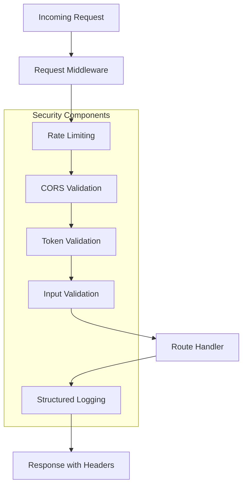

<!-- a89fd154-5443-4c3d-9f49-08adbfa475b2 bad7d31d-a93b-471e-ad98-17b282876a14 -->
# Security Implementation Plan

## Overview

This plan implements comprehensive security hardening for the backend while maintaining development-friendly features. Each phase is independently testable with detailed AI-provided testing instructions.

## Architecture Flow



---

## Phase 1: Remove Hardcoded Credentials and Add Environment Validation

**Goal**: Remove all hardcoded credentials from code and implement strict environment variable validation that fails fast if required variables are missing.

**Files to Modify**:

- [`backend/config.py`](backend/config.py)

**Detailed Implementation Steps**:

1. **Remove hardcoded defaults from Config class**:

   - Remove default values from `AUTH0_DOMAIN` (currently `'dev-e0a45vyrmttly5df.us.auth0.com'`)
   - Remove default values from `AUTH0_CLIENT_ID` (currently `'itttKkwDovKRteOJ9MZZPa21uNgfPuq0'`)
   - Keep sensible defaults for non-sensitive configs (e.g., `REDIS_PORT`, `REDIS_DB`)

2. **Add environment awareness**:

   - Add `IS_PRODUCTION` property based on `FLASK_ENV`
   - Add `IS_DEVELOPMENT` property for convenience

3. **Enhance Config.validate() method**:

   - Add `AUTH0_CLIENT_SECRET` to required variables list
   - Add `AUTH0_CLIENT_ID` to required variables (since removing default)
   - Validate all Auth0-related variables are present
   - Provide clear error messages indicating which variables are missing

4. **Add helper methods**:

   - `is_auth0_configured()` - Check if Auth0 is properly configured
   - `get_required_env(var_name)` - Get required env var or raise ValueError

5. **Update environment loading**:

   - Add warning if running without .env file in development
   - Keep current .env loading logic but improve error messages

**Code Structure**:

```python
class Config:
    FLASK_ENV = os.getenv('FLASK_ENV', 'development')
    IS_PRODUCTION = FLASK_ENV == 'production'
    IS_DEVELOPMENT = not IS_PRODUCTION
    
    # No defaults - fail fast if missing
    AUTH0_DOMAIN = os.getenv('AUTH0_DOMAIN')  # No default!
    AUTH0_CLIENT_ID = os.getenv('AUTH0_CLIENT_ID')  # No default!
    AUTH0_CLIENT_SECRET = os.getenv('AUTH0_CLIENT_SECRET')
    
    @staticmethod
    def validate():
        # Enhanced validation with clear error messages
```

**Dependencies**: None (can be done independently)

**AI Testing Instructions**:

- AI will provide detailed step-by-step testing instructions including:
  - Testing with missing env vars (should fail fast)
  - Testing with all env vars present (should work)
  - Verifying no hardcoded credentials in codebase
  - Testing Config.validate() error messages

---

## Phase 2: Secure CORS Configuration with Environment Awareness

**Goal**: Implement environment-aware CORS configuration that allows localhost in development but restricts origins in production.

**Files to Modify**:

- [`backend/app.py`](backend/app.py)
- [`backend/config.py`](backend/config.py) - Add CORS config

**Detailed Implementation Steps**:

1. **Add CORS configuration to Config class**:

   - Add `CORS_ALLOWED_ORIGINS` property that reads from environment
   - In production: Parse comma-separated `ALLOWED_ORIGINS` env var
   - In development: Default to `['http://localhost:3000', 'http://127.0.0.1:3000']`
   - Add validation to ensure at least one origin is configured in production

2. **Update Flask CORS configuration in app.py**:

   - Replace `CORS(app, origins="*")` with environment-aware configuration
   - Set `supports_credentials=True` for cookie-based auth if needed
   - Explicitly configure allowed methods: `['GET', 'POST', 'PUT', 'PATCH', 'DELETE', 'OPTIONS']`
   - Explicitly configure allowed headers: `['Content-Type', 'Authorization']`
   - Set `max_age=3600` for preflight cache (1 hour)

3. **Add CORS error handling**:

   - Add middleware to log CORS violations (for security monitoring)
   - Return clear error messages for CORS failures

**Code Structure**:

```python
# In config.py
if IS_PRODUCTION:
    origins_env = os.getenv('ALLOWED_ORIGINS', '')
    CORS_ALLOWED_ORIGINS = [o.strip() for o in origins_env.split(',') if o.strip()]
    if not CORS_ALLOWED_ORIGINS:
        raise ValueError("ALLOWED_ORIGINS must be set in production")
else:
    CORS_ALLOWED_ORIGINS = ['http://localhost:3000', 'http://127.0.0.1:3000']

# In app.py
CORS(app, 
     origins=Config.CORS_ALLOWED_ORIGINS,
     supports_credentials=True,
     methods=['GET', 'POST', 'PUT', 'PATCH', 'DELETE', 'OPTIONS'],
     allow_headers=['Content-Type', 'Authorization'],
     max_age=3600)
```

**Dependencies**: Phase 1 (uses Config.IS_PRODUCTION)

**AI Testing Instructions**:

- AI will provide testing instructions for:
  - Verifying localhost works in development
  - Verifying unauthorized origins are blocked in production mode
  - Testing preflight OPTIONS requests
  - Verifying CORS headers in responses
  - Testing with multiple allowed origins

---

## Phase 3: Implement Structured Logging with Sanitization

**Goal**: Replace all `print()` statements with proper structured logging that never exposes sensitive data, with environment-aware log levels.

**Files to Create**:

- [`backend/utils/logger.py`](backend/utils/logger.py) - New logging utility

**Files to Modify**:

- [`backend/app.py`](backend/app.py) - Initialize logger
- [`backend/utils/auth.py`](backend/utils/auth.py) - Replace print statements
- [`backend/routes/auth.py`](backend/routes/auth.py) - Replace print statements
- [`backend/routes/document.py`](backend/routes/document.py) - Replace print statements
- [`backend/routes/chat.py`](backend/routes/chat.py) - Replace print statements
- All other route files with print statements

**Detailed Implementation Steps**:

1. **Create structured logging utility**:

   - Set up Python logging with proper configuration
   - JSON formatting for production (easier parsing by log aggregation tools)
   - Human-readable formatting for development
   - Different log levels: DEBUG (dev only), INFO, WARNING, ERROR, CRITICAL
   - File rotation configuration (max 10 files, 10MB each)
   - Log to both console and file (`logs/app.log`)

2. **Implement log sanitization**:

   - Create `sanitize_data()` function to remove sensitive fields
   - Sensitive patterns: tokens, passwords, API keys, secrets, credit cards
   - Mask partial data: `token[:8]...` for debugging without exposure
   - Create helper methods: `log_request()`, `log_error()`, `log_security_event()`

3. **Replace print statements in auth.py**:

   - Convert error prints to `logger.error()`
   - Convert info prints to `logger.info()`
   - Ensure no sensitive data in logs (tokens, passwords)
   - Add request context (user_id, IP, endpoint)

4. **Replace print statements in other routes**:

   - Convert debug prints to `logger.debug()` (dev only)
   - Convert info prints to `logger.info()`
   - Convert warnings to `logger.warning()`
   - Ensure all error logs include context

5. **Add request context logging**:

   - Log request ID, user_id, IP address, endpoint, method
   - Include in all log entries automatically via middleware

6. **Create security event logging**:

   - Special logger for security events (failed logins, token validation failures, etc.)
   - Higher log level for security events
   - Include IP, user_agent, timestamp

**Code Structure**:

```python
# utils/logger.py
def sanitize_data(data):
    """Remove sensitive information from log data"""
    sensitive_keys = ['password', 'token', 'secret', 'api_key', 'access_token']
    # Implementation

def get_logger(name):
    """Get configured logger instance"""
    # Implementation with env-aware config
```

**Dependencies**: Phase 1 (uses Config.IS_PRODUCTION)

**AI Testing Instructions**:

- AI will provide testing instructions for:
  - Verifying sensitive data is never logged (tokens, passwords)
  - Testing log rotation works
  - Verifying different log levels work correctly
  - Testing structured logging output format
  - Verifying request context appears in logs
  - Testing security event logging

---

## Phase 4: Add Request ID Tracking

**Goal**: Implement request ID tracking for all requests to enable debugging and request tracing across distributed systems.

**Files to Create**:

- [`backend/utils/request_id.py`](backend/utils/request_id.py) - Request ID utility

**Files to Modify**:

- [`backend/app.py`](backend/app.py) - Add middleware
- [`backend/utils/logger.py`](backend/utils/logger.py) - Include request ID in logs

**Detailed Implementation Steps**:

1. **Create request ID utility**:

   - Generate unique request ID using UUID4 for each request
   - Store in Flask `g` object for request-scoped access
   - Extract from `X-Request-ID` header if present (for tracing through services)

2. **Add Flask middleware**:

   - Before request: Generate/extract request ID, store in `g.request_id`
   - After request: Add `X-Request-ID` header to response
   - Ensure request ID is available to all route handlers

3. **Update logger to include request ID**:

   - Automatically include request ID in all log entries
   - Add request ID filter to logging configuration

4. **Add request ID to error responses**:

   - Include request ID in JSON error responses (for user to report issues)
   - Format: `{'error': '...', 'request_id': 'uuid', ...}`

5. **Update logging calls**:

   - Ensure all log entries automatically include request ID via context
   - No need to manually add request ID to each log call

**Code Structure**:

```python
# utils/request_id.py
def get_request_id():
    """Get current request ID from Flask g object"""
    # Implementation

def generate_request_id():
    """Generate new request ID"""
    # Implementation

# In app.py
@app.before_request
def set_request_id():
    # Implementation

@app.after_request
def add_request_id_header(response):
    # Implementation
```

**Dependencies**: Phase 3 (uses logger)

**AI Testing Instructions**:

- AI will provide testing instructions for:
  - Verifying request ID is generated for each request
  - Verifying request ID appears in response headers
  - Verifying request ID appears in all log entries
  - Verifying request ID appears in error responses
  - Testing with X-Request-ID header from client
  - Testing request ID uniqueness across concurrent requests

---

## Phase 5: Implement Rate Limiting

**Goal**: Protect authentication and API endpoints from brute force attacks and abuse using Flask-Limiter.

**Files to Modify**:

- [`backend/requirements.txt`](backend/requirements.txt) - Add flask-limiter
- [`backend/app.py`](backend/app.py) - Configure rate limiter
- [`backend/config.py`](backend/config.py) - Add rate limit config
- [`backend/routes/auth.py`](backend/routes/auth.py) - Add rate limit decorators

**Detailed Implementation Steps**:

1. **Add Flask-Limiter to requirements.txt**:

   - Add `flask-limiter>=3.0.0`
   - Update requirements

2. **Configure rate limiter storage**:

   - Use Redis if available (from existing RedisService)
   - Fall back to in-memory storage if Redis unavailable
   - Configure in `app.py` with proper initialization

3. **Add rate limit configuration to Config**:

   - `RATE_LIMIT_STORAGE_URL` - Redis URL or 'memory://'
   - `RATE_LIMIT_ENABLED` - Toggle (default True)
   - Default limits for different endpoint types

4. **Apply rate limits to auth endpoints**:

   - `/api/auth/login` - 5 attempts per 15 minutes per IP
   - `/api/auth/register` - 3 attempts per hour per IP
   - `/api/auth/sync` - 10 requests per minute per IP
   - `/api/auth/verify` - 20 requests per minute per IP

5. **Add rate limit headers to responses**:

   - `X-RateLimit-Limit` - Maximum requests allowed
   - `X-RateLimit-Remaining` - Remaining requests in window
   - `X-RateLimit-Reset` - Unix timestamp when limit resets

6. **Implement rate limit error handling**:

   - Return 429 status code when limit exceeded
   - User-friendly error message: "Too many requests. Please try again later."
   - Log rate limit violations as security events (with IP, endpoint)

7. **Add rate limit exemption for health checks**:

   - `/api/health` endpoint should not be rate limited

8. **Configure per-user rate limits (optional)**:

   - For authenticated endpoints, limit by user_id instead of IP
   - Prevents single user from overwhelming system

**Code Structure**:

```python
# In app.py
from flask_limiter import Limiter
from flask_limiter.util import get_remote_address

limiter = Limiter(
    app=app,
    key_func=get_remote_address,
    storage_uri=Config.RATE_LIMIT_STORAGE_URL,
    default_limits=["200 per day", "50 per hour"]
)

# In routes/auth.py
@auth_bp.route('/login', methods=['POST'])
@limiter.limit("5 per 15 minutes")
def login():
    # Implementation
```

**Dependencies**: Phase 1 (uses Config), Phase 3 (for security logging)

**AI Testing Instructions**:

- AI will provide testing instructions for:
  - Testing login rate limit (5 attempts per 15 min)
  - Testing register rate limit (3 per hour)
  - Verifying rate limit headers in responses
  - Verifying 429 status code when limit exceeded
  - Testing rate limit reset after time window
  - Testing different IPs have independent limits
  - Verifying rate limit violations are logged
  - Testing Redis-backed rate limiting
  - Testing memory fallback if Redis unavailable

---

## Phase 6: Add Security Headers

**Goal**: Implement security headers (HSTS, CSP, X-Frame-Options, etc.) to protect against common web vulnerabilities.

**Files to Create**:

- [`backend/utils/security_headers.py`](backend/utils/security_headers.py) - Security headers utility

**Files to M