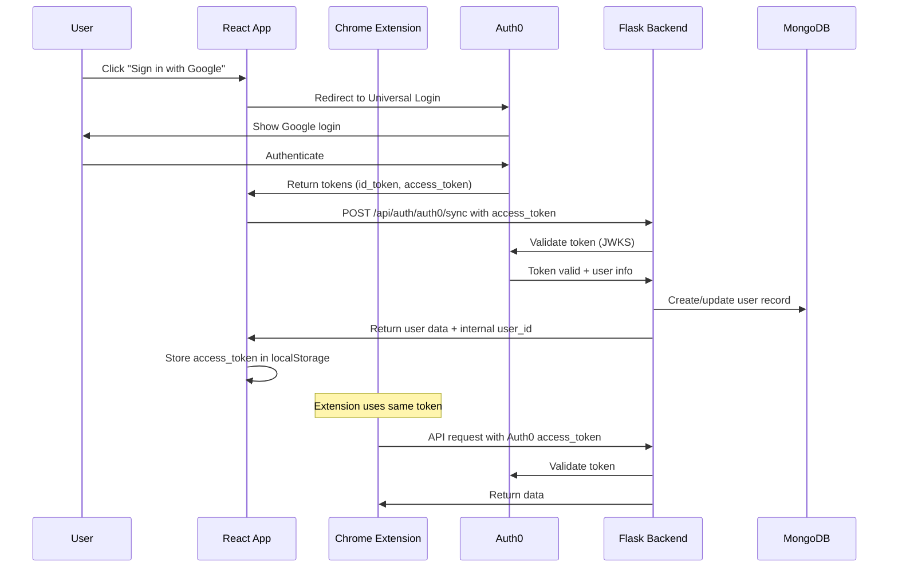

# Auth0 Authentication Migration Plan

## Overview

Migrate from custom JWT authentication to Auth0 in three phases:
- **Phase 1**: Google Sign-In (keep existing email/password working)
- **Phase 2**: Apple Sign-In  
- **Phase 3**: Migrate email/password to Auth0 & remove legacy auth

## Architecture Overview



## Current Authentication Flow (What We Have Now)

### Frontend (`frontend/src/`)
- `utils/auth.js` - Stores JWT in localStorage
- `services/api.js` - Attaches `Bearer ${token}` to all requests
- `components/ProtectedRoute.js` - Checks if token exists
- `pages/LoginEmail.js`, `LoginPassword.js`, `Register.js` - Custom login forms

### Backend (`backend/`)
- `utils/auth.py` - `generate_token()`, `verify_token()`, `get_user_id_from_token()`
- `routes/auth.py` - `/register`, `/login` endpoints
- All protected routes use `get_user_id_from_token()`

### Chrome Extension (`chrome-extension/`)
- Stores JWT token in `chrome.storage.local`
- Sends `Authorization: Bearer ${token}` to API
- User manually copies token from web app

---

# PHASE 1: Google Sign-In Integration

**Goal**: Add Google Sign-In via Auth0 while keeping existing email/password login working. Chrome extension continues to work with both auth methods.

## What YOU Need to Do (Auth0 Dashboard Setup)

### Step 1: Create Auth0 Account & Tenant
1. Go to https://auth0.com/signup
2. Sign up with your email
3. Create a tenant name (e.g., `stitch-app`)
4. Select your region (US recommended)

### Step 2: Create Single Page Application
1. Dashboard → Applications → Applications → **+ Create Application**
2. Name: `Stitch Frontend`
3. Type: **Single Page Web Applications**
4. Click Create
5. Go to **Settings** tab, configure:
   - **Allowed Callback URLs**: `http://localhost:3000/callback`
   - **Allowed Logout URLs**: `http://localhost:3000`
   - **Allowed Web Origins**: `http://localhost:3000`
6. Click **Save Changes**
7. **Note down**: `Domain` and `Client ID`

### Step 3: Create API
1. Dashboard → Applications → APIs → **+ Create API**
2. Name: `Stitch API`
3. Identifier: `https://api.stitch.app` (remember this exactly)
4. Signing Algorithm: `RS256`
5. Click Create
6. **Note down**: The Identifier (this is your "audience")

### Step 4: Configure Google Connection
1. **In Google Cloud Console** (https://console.cloud.google.com/):
   - Create/select a project
   - Go to APIs & Services → OAuth consent screen
   - Configure consent screen (External, fill required fields)
   - Go to APIs & Services → Credentials
   - Create Credentials → OAuth client ID
   - Application type: Web application
   - Name: `Auth0 Google Connection`
   - Authorized redirect URIs: `https://YOUR-AUTH0-DOMAIN/login/callback`
   - Copy **Client ID** and **Client Secret**

2. **In Auth0 Dashboard**:
   - Go to Authentication → Social
   - Click on **Google**
   - Enter the Client ID and Client Secret from Google
   - Under **Applications**, toggle ON your `Stitch Frontend` app
   - Click **Save**

### Values I Need From You
| Value | Example |
|-------|---------|
| Auth0 Domain | `your-tenant.us.auth0.com` |
| Client ID | `abc123XYZ...` |
| API Identifier | `https://api.stitch.app` |

---

## Phase 1 Implementation Details

### 1.1 Frontend Changes

#### Install Auth0 SDK
```bash
cd frontend
npm install @auth0/auth0-react
```

#### Create: `frontend/src/config/auth0.js`
```javascript
export const auth0Config = {
  domain: process.env.REACT_APP_AUTH0_DOMAIN,
  clientId: process.env.REACT_APP_AUTH0_CLIENT_ID,
  authorizationParams: {
    redirect_uri: window.location.origin + '/callback',
    audience: process.env.REACT_APP_AUTH0_AUDIENCE,
    scope: 'openid profile email'
  },
  cacheLocation: 'localstorage' // Important for token persistence
};
```

#### Update: `frontend/src/index.js`
- Wrap app with Auth0Provider

#### Update: `frontend/src/pages/LoginEmail.js`
- Connect Google button to `loginWithRedirect({ connection: 'google-oauth2' })`
- Keep existing email form working (calls existing `/api/auth/login`)

#### Create: `frontend/src/pages/AuthCallback.js`
- Handle Auth0 redirect
- Call backend `/api/auth/auth0/sync` to sync user
- Store token and redirect to workspace

#### Update: `frontend/src/utils/auth.js`
- Add functions for Auth0 token management
- Keep existing `getToken()`, `setToken()` working

#### Update: `frontend/src/services/api.js`
- Use Auth0 `getAccessTokenSilently()` when available
- Fall back to localStorage token for legacy sessions

#### Update: `frontend/src/components/ProtectedRoute.js`
- Check both Auth0 authentication AND legacy token

#### Update: `frontend/src/App.js`
- Add `/callback` route for Auth0

### 1.2 Backend Changes

#### Install Dependencies
```bash
pip install python-jose[cryptography] requests
```

#### Create: `backend/utils/auth0_validator.py`
```python
# Validates Auth0 JWT tokens using JWKS
# Fetches signing keys from Auth0
# Returns user info from token
```

#### Update: `backend/config.py`
- Add Auth0 configuration variables

#### Update: `backend/utils/auth.py`
- Modify `get_user_id_from_token()` to:
  1. Try to validate as Auth0 token first
  2. Fall back to legacy JWT validation
  3. Return user_id in both cases

#### Update: `backend/models/database.py`
Add to UserModel:
```python
# New fields
{
    'auth0_id': 'google-oauth2|123456789',  # Auth0 user identifier
    'auth_provider': 'google',               # 'google', 'apple', 'email'
    'email': 'user@example.com',
    'email_verified': True,
    'picture': 'https://...',
    # ... existing fields (username becomes email for OAuth users)
}

# New methods
- get_user_by_email(email)
- get_user_by_auth0_id(auth0_id)
- get_or_create_oauth_user(auth0_id, email, name, picture, provider)
- link_auth0_to_existing_user(user_id, auth0_id)
```

#### Update: `backend/routes/auth.py`
Add new endpoint:
```python
@auth_bp.route('/auth0/sync', methods=['POST'])
def sync_auth0_user():
    """
    Called after Auth0 login to sync user to MongoDB.
    - Validates Auth0 access token
    - Creates user if new, or links to existing user by email
    - Returns user data for frontend
    """
```

### 1.3 Chrome Extension Compatibility

The Chrome extension will work with Auth0 tokens because:
1. Auth0 access tokens are standard JWTs
2. They're sent as `Bearer ${token}` (same format)
3. Backend validates both token types

**User flow for extension**:
1. User logs in via Google on web app
2. User copies Auth0 access token from web app (same as before)
3. Extension stores and uses the token
4. Backend validates it as Auth0 token

### 1.4 Environment Variables

#### Frontend `.env`
```
REACT_APP_AUTH0_DOMAIN=your-tenant.us.auth0.com
REACT_APP_AUTH0_CLIENT_ID=your-client-id
REACT_APP_AUTH0_AUDIENCE=https://api.stitch.app
REACT_APP_API_URL=http://localhost:5001
```

#### Backend `.env`
```
AUTH0_DOMAIN=your-tenant.us.auth0.com
AUTH0_API_AUDIENCE=https://api.stitch.app
AUTH0_ALGORITHMS=RS256
# Keep existing vars for legacy auth
JWT_SECRET=your-existing-secret
```

### 1.5 Files Changed in Phase 1

| File | Action | Purpose |
|------|--------|---------|
| `frontend/package.json` | Modify | Add @auth0/auth0-react |
| `frontend/src/config/auth0.js` | Create | Auth0 configuration |
| `frontend/src/index.js` | Modify | Add Auth0Provider |
| `frontend/src/App.js` | Modify | Add /callback route |
| `frontend/src/pages/LoginEmail.js` | Modify | Add Google login button handler |
| `frontend/src/pages/AuthCallback.js` | Create | Handle OAuth callback |
| `frontend/src/utils/auth.js` | Modify | Add Auth0 token helpers |
| `frontend/src/services/api.js` | Modify | Support both token types |
| `frontend/src/components/ProtectedRoute.js` | Modify | Check both auth methods |
| `backend/requirements.txt` | Modify | Add python-jose, requests |
| `backend/config.py` | Modify | Add Auth0 config vars |
| `backend/utils/auth0_validator.py` | Create | Auth0 token validation |
| `backend/utils/auth.py` | Modify | Dual token validation |
| `backend/models/database.py` | Modify | OAuth user fields/methods |
| `backend/routes/auth.py` | Modify | Add /auth0/sync endpoint |

---

# PHASE 2: Apple Sign-In Integration

**Goal**: Add Apple Sign-In alongside Google. Same architecture, just another social provider.

## What YOU Need to Do

### Apple Developer Setup
1. Go to https://developer.apple.com/account/ (requires $99/year membership)
2. Certificates, Identifiers & Profiles → Identifiers
3. Create App ID with "Sign in with Apple" capability
4. Create Services ID (for web auth)
5. Configure return URL: `https://YOUR-AUTH0-DOMAIN/login/callback`
6. Create private key for Sign in with Apple

### Auth0 Dashboard
1. Authentication → Social → Apple
2. Enter: Team ID, Services ID (Client ID), Key ID, Private Key
3. Enable for your application

## Phase 2 Implementation

### Frontend
- Update `LoginEmail.js` to enable Apple button
- Same callback flow as Google

### Backend
- No changes needed (Auth0 handles Apple token validation)
- User sync works the same way

---

# PHASE 3: Migrate Email/Password to Auth0

**Goal**: Move all authentication to Auth0. Remove legacy JWT system.

## What YOU Need to Do

### Auth0 Dashboard
1. Authentication → Database → Create Connection
2. Name: `Username-Password-Authentication`
3. Enable for your application

## Phase 3 Implementation

### 3.1 Frontend Changes

#### Update: `frontend/src/pages/LoginEmail.js`
- Change email form to use Auth0 `loginWithRedirect({ connection: 'Username-Password-Authentication' })`
- Remove calls to `/api/auth/login`

#### Update: `frontend/src/pages/Register.js`
- Use Auth0 signup: `loginWithRedirect({ screen_hint: 'signup' })`
- Remove calls to `/api/auth/register`

#### Delete/Deprecate: `frontend/src/pages/LoginPassword.js`
- No longer needed (Auth0 handles password entry)

#### Update: `frontend/src/utils/auth.js`
- Remove legacy token functions (or keep as aliases)
- All auth goes through Auth0

#### Update: `frontend/src/services/api.js`
- Remove legacy token fallback
- Only use Auth0 tokens

#### Update: `frontend/src/components/ProtectedRoute.js`
- Only check Auth0 `isAuthenticated`

### 3.2 Backend Changes

#### Update: `backend/utils/auth.py`
- Remove legacy JWT validation
- Only validate Auth0 tokens

#### Update: `backend/routes/auth.py`
- Remove or deprecate `/login` and `/register` endpoints
- Keep `/auth0/sync` as the only auth endpoint

#### Optional: Data Migration
- Existing users with email/password can:
  1. Sign up again with Auth0 (new account linked by email)
  2. Or use a migration script to import users to Auth0

### 3.3 Chrome Extension Update

#### Update: `chrome-extension/popup.html` & `popup.js`
- Add instructions for getting Auth0 token
- Or implement Auth0 login directly in extension (advanced)

### 3.4 Files to Remove/Deprecate in Phase 3

| File | Action |
|------|--------|
| `frontend/src/pages/LoginPassword.js` | Delete or redirect |
| `backend/utils/auth.py` (legacy functions) | Remove legacy JWT code |
| `backend/routes/auth.py` (`/login`, `/register`) | Remove endpoints |

---

## Testing Checklist

### Phase 1
- [ ] Google Sign-In redirects to Auth0
- [ ] Auth0 returns to /callback
- [ ] User is created in MongoDB
- [ ] User can access protected routes
- [ ] Existing email/password login still works
- [ ] Chrome extension works with Auth0 token
- [ ] Chrome extension works with legacy token
- [ ] Logout works correctly

### Phase 2
- [ ] Apple Sign-In works
- [ ] Apple users created in MongoDB
- [ ] Both Google and Apple users can use extension

### Phase 3
- [ ] Email/password uses Auth0 Universal Login
- [ ] Registration uses Auth0
- [ ] Legacy JWT code removed
- [ ] All API routes validate Auth0 only
- [ ] Chrome extension documentation updated

---

## Rollback Plan

If issues occur during any phase:

### Phase 1 Rollback
- Remove Auth0Provider from index.js
- Revert LoginEmail.js changes
- Disable Google connection in Auth0
- Legacy auth continues working

### Phase 2 Rollback  
- Disable Apple connection in Auth0
- Google and legacy auth continue working

### Phase 3 Rollback
- Re-enable legacy JWT validation in backend
- Restore login/register endpoints
- Update frontend to use legacy auth

---

## Security Considerations

1. **Token Storage**: Auth0 tokens stored in localStorage (same as current)
2. **Token Expiry**: Auth0 handles token refresh automatically
3. **HTTPS**: Required for production Auth0 callbacks
4. **CORS**: Backend must allow Auth0 domain for token validation

---

## Timeline Estimate

| Phase | Effort | Description |
|-------|--------|-------------|
| Phase 1 | 4-6 hours | Google Sign-In + dual auth support |
| Phase 2 | 1-2 hours | Apple Sign-In (mostly config) |
| Phase 3 | 2-3 hours | Remove legacy auth |

---

## Current To-dos

- [ ] Auth0 Dashboard setup (User action required)
- [ ] Install @auth0/auth0-react and configure Auth0Provider
- [ ] Update LoginEmail.js for Google Sign-In
- [ ] Create AuthCallback.js for OAuth redirect
- [ ] Create auth0_validator.py for backend token validation
- [ ] Update UserModel with OAuth fields
- [ ] Add /auth0/sync endpoint
- [ ] Set up environment variables
- [ ] Test Google Sign-In flow
- [ ] Test Chrome extension compatibility

