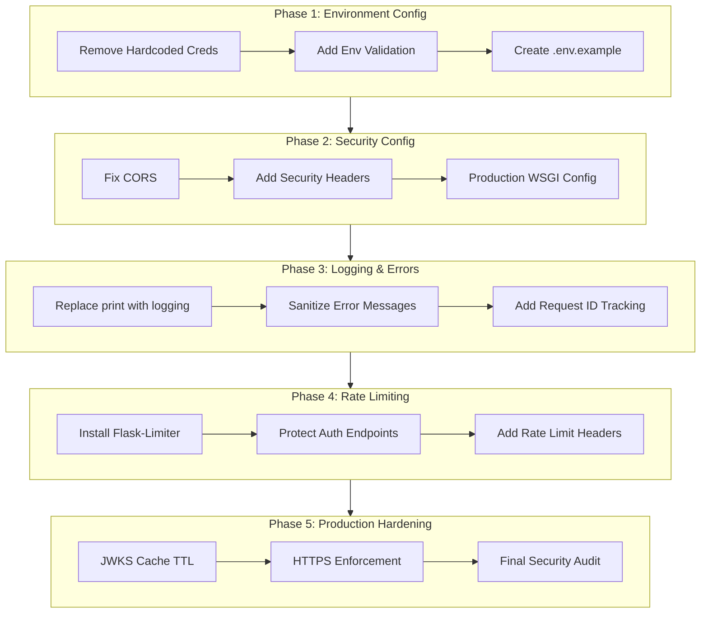

# Production Authentication Security Hardening Plan

## Overview

This plan addresses all security and production-readiness issues identified in the Auth0 implementation. Each phase is independently testable and builds upon the previous phase.

## Architecture Changes

## Phase 1: Environment Configuration & Credential Security

**Goal**: Remove all hardcoded credentials and ensure proper environment variable handling.

### Tasks

1. **Remove hardcoded defaults from `frontend/src/config/auth0.js`**

   - Remove fallback values for `domain`, `clientId`, and `audience`
   - Make environment variables required (fail if missing)
   - Add validation function

2. **Remove hardcoded defaults from `backend/config.py`**

   - Remove fallback values for `AUTH0_DOMAIN` and `AUTH0_CLIENT_ID`
   - Add `AUTH0_CLIENT_SECRET` to required variables in `Config.validate()`
   - Ensure all Auth0 config fails fast if missing

3. **Create `.env.example` files**

   - Create `backend/.env.example` with all required variables (no secrets)
   - Create `frontend/.env.example` with required React env vars
   - Document each variable's purpose

4. **Update `.gitignore`** (if needed)

   - Ensure `.env` files are ignored (already done, verify)

### Testing Criteria

- [ ] Frontend fails to start if `REACT_APP_AUTH0_DOMAIN` is missing
- [ ] Backend fails to start if `AUTH0_DOMAIN` or `AUTH0_CLIENT_SECRET` is missing
- [ ] `.env.example` files exist and are committed
- [ ] No hardcoded credentials in source code (grep verification)

### Files to Modify

- `frontend/src/config/auth0.js` - Remove defaults, add validation
- `backend/config.py` - Remove defaults, add client secret validation
- `backend/.env.example` - Create new file
- `frontend/.env.example` - Create new file

---

## Phase 2: CORS & Production Configuration

**Goal**: Secure CORS configuration and set up production-ready Flask settings.

### Tasks

1. **Fix CORS configuration in `backend/app.py`**

   - Replace `origins="*"` with environment-based configuration
   - Allow specific origins in production, `localhost` in development
   - Add `supports_credentials=True` if needed for cookies
   - Configure allowed methods and headers explicitly

2. **Add production WSGI configuration**

   - Create `backend/wsgi.py` for production deployment
   - Update `app.py` to detect environment (development vs production)
   - Remove `debug=True` from production code path
   - Add production server recommendations (gunicorn) to requirements or docs

3. **Add security headers middleware**

   - Create `backend/utils/security_headers.py`
   - Add HSTS, CSP, X-Frame-Options, X-Content-Type-Options headers
   - Apply only in production mode

4. **Environment-based configuration**

   - Use `FLASK_ENV` or `ENVIRONMENT` variable to determine mode
   - Different CORS settings for dev vs production
   - Different logging levels per environment

### Testing Criteria

- [ ] CORS blocks requests from unauthorized origins in production mode
- [ ] CORS allows localhost in development mode
- [ ] Security headers present in production responses
- [ ] Debug mode disabled when `FLASK_ENV=production`
- [ ] Application starts correctly in both dev and production modes

### Files to Modify

- `backend/app.py` - Environment-based CORS, remove debug mode
- `backend/wsgi.py` - Create new file for production
- `backend/utils/security_headers.py` - Create new file
- `backend/requirements.txt` - Add gunicorn (optional, for production)

---

## Phase 3: Logging & Error Handling

**Goal**: Replace print statements with proper logging and sanitize error messages.

### Tasks

1. **Set up Python logging in `backend/utils/logger.py`**

   - Create structured logging configuration
   - Different log levels for dev vs production
   - JSON formatting for production (easier parsing)
   - File rotation configuration

2. **Replace all `print()` statements in `backend/routes/auth.py`**

   - Convert to appropriate log levels (info, warning, error)
   - Sanitize sensitive data (never log tokens, passwords, or full error details)
   - Add request context (user_id, IP, request_id)

3. **Sanitize error messages in auth routes**

   - Generic user-facing error messages
   - Detailed errors only in server logs
   - Remove Auth0 configuration details from user responses
   - Map Auth0 errors to user-friendly messages

4. **Add request ID tracking**

   - Generate unique request ID per request
   - Include in logs and error responses (for debugging)
   - Middleware to add request ID to Flask context

5. **Update other routes** (if time permits)

   - Replace print statements in other route files
   - Apply same logging standards

### Testing Criteria

- [ ] No `print()` statements in `backend/routes/auth.py` (grep verification)
- [ ] Logs contain structured information (request ID, user, etc.)
- [ ] User-facing error messages are generic
- [ ] Sensitive data (tokens, passwords) never appears in logs
- [ ] Request ID appears in both logs and error responses
- [ ] Logs are properly formatted (JSON in production)

### Files to Modify

- `backend/utils/logger.py` - Create new file
- `backend/routes/auth.py` - Replace prints, sanitize errors
- `backend/app.py` - Add request ID middleware
- `backend/routes/*.py` - Update other routes (optional, Phase 3.5)

---

## Phase 4: Rate Limiting

**Goal**: Protect authentication endpoints from brute force and abuse.

### Tasks

1. **Install and configure Flask-Limiter**

   - Add `flask-limiter` to `backend/requirements.txt`
   - Configure rate limiter in `backend/app.py`
   - Use Redis or in-memory storage (Redis recommended for production)

2. **Apply rate limits to auth endpoints**

   - `/api/auth/login` - 5 attempts per 15 minutes per IP
   - `/api/auth/register` - 3 attempts per hour per IP
   - `/api/auth/sync` - 10 requests per minute per IP
   - `/api/auth/verify` - 20 requests per minute per IP

3. **Add rate limit headers to responses**

   - Include `X-RateLimit-Limit`, `X-RateLimit-Remaining`, `X-RateLimit-Reset`
   - Return 429 status with clear error message when limit exceeded

4. **Configure rate limit storage**

   - Development: In-memory storage
   - Production: Redis (if available) or in-memory with note in docs

5. **Add rate limit error handling**

   - User-friendly error message
   - Log rate limit violations (for security monitoring)

### Testing Criteria

- [ ] Login endpoint blocks after 5 failed attempts (15 min window)
- [ ] Register endpoint blocks after 3 attempts (1 hour window)
- [ ] Rate limit headers present in responses
- [ ] 429 status code returned when limit exceeded
- [ ] Rate limits reset correctly after time window
- [ ] Different IPs have independent rate limits

### Files to Modify

- `backend/requirements.txt` - Add flask-limiter
- `backend/app.py` - Configure rate limiter
- `backend/routes/auth.py` - Add rate limit decorators
- `backend/config.py` - Add rate limit configuration

---

## Phase 5: Production Hardening & Final Security

**Goal**: Final security improvements and production optimizations.

### Tasks

1. **Implement JWKS cache TTL**

   - Update `backend/utils/auth0_validator.py`
   - Add TTL to `@lru_cache` or use custom caching with expiration
   - Cache for 1 hour, refresh on validation failure
   - Add manual cache clear function (for key rotation)

2. **HTTPS enforcement documentation**

   - Document HTTPS requirements in production
   - Add health check endpoint that verifies HTTPS (if behind proxy)
   - Note in deployment docs about reverse proxy configuration

3. **Token storage security review**

   - Document localStorage usage (acceptable for Auth0)
   - Add Content Security Policy (CSP) headers to prevent XSS
   - Review and document XSS prevention measures

4. **Security audit checklist**

   - Verify all environment variables are set in production
   - Verify CORS is restricted
   - Verify debug mode is off
   - Verify rate limiting is active
   - Verify logging is working
   - Verify security headers are present

5. **Create production deployment guide**

   - Document all required environment variables
   - Document CORS configuration
   - Document rate limiting setup
   - Document logging configuration
   - Document HTTPS/SSL setup

### Testing Criteria

- [ ] JWKS cache refreshes after TTL expiration
- [ ] Cache clears correctly on validation failure
- [ ] CSP headers present in production responses
- [ ] All security checklist items verified
- [ ] Deployment guide is complete and accurate
- [ ] Production environment starts without errors

### Files to Modify

- `backend/utils/auth0_validator.py` - Add TTL to JWKS cache
- `backend/utils/security_headers.py` - Add CSP headers
- `PRODUCTION_DEPLOYMENT.md` - Create new deployment guide
- `backend/app.py` - Add HTTPS check (optional)

---

## Testing Strategy

### Per-Phase Testing

Each phase includes specific testing criteria. Test incrementally after each phase.

### Integration Testing

After all phases:

1. **End-to-end auth flow test**

   - Register new user
   - Login with email/password
   - Login with Google OAuth
   - Verify token validation
   - Test rate limiting
   - Test error handling

2. **Security testing**

   - Attempt CORS attack from unauthorized origin
   - Attempt brute force on login endpoint
   - Verify no sensitive data in logs
   - Verify security headers present

3. **Production simulation**

   - Set `FLASK_ENV=production`
   - Set all production environment variables
   - Verify application starts correctly
   - Verify all security measures active

## Dependencies Between Phases

- **Phase 1** must be completed first (removes security risks)
- **Phase 2** can start after Phase 1
- **Phase 3** can run in parallel with Phase 2
- **Phase 4** requires Phase 3 (for logging rate limit violations)
- **Phase 5** requires all previous phases

## Estimated Timeline

- Phase 1: 1-2 hours
- Phase 2: 2-3 hours
- Phase 3: 3-4 hours
- Phase 4: 2-3 hours
- Phase 5: 2-3 hours

**Total**: 10-15 hours

## Notes

- **Production Domain**: Update CORS configuration in Phase 2 with your actual production domain(s)
- **Redis**: Phase 4 rate limiting works with in-memory storage, but Redis is recommended for production
- **Environment Variables**: All sensitive values must be set in production environment (never in code)
- **Backward Compatibility**: Phase 1 changes may break development if `.env` files aren't set up - ensure team has `.env.example` files